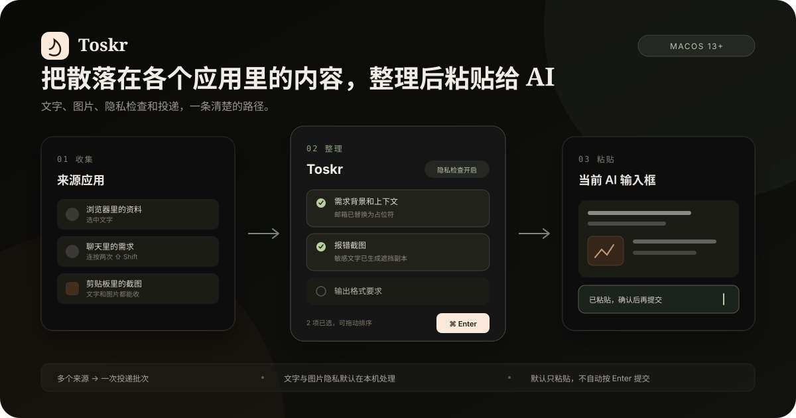

# Toskr

**An AI message relay**

Collect text and images from different apps, organize and review privacy, then paste them into your current AI input.

[Website](https://toskr.kaibin.me/) · [Download the latest release](https://github.com/kristalderoyysi54/toskr/releases/latest) · [简体中文](README.md) · English

> **Text and images from source apps** → **Collect, organize, and review privacy in Toskr** → **Your current AI input**

> The app UI is currently Chinese-only.

Toskr pastes by default. It only submits when you enable auto-submit for that target app.

  

## Three steps

1. **Collect** Select text and double-tap `⇧ Shift`. Copied text and images also appear in Clipboard History.
2. **Prepare** Select one or more cards, change their order, and group them for this delivery. Review sensitive text or images when needed.
3. **Paste** Focus the destination input, open Toskr, and press `⌘ Enter`. Toskr returns to that app and pastes the content. It does not press Enter by default.

  

Clipboard history · card-based preparation · task reminders

## Core capabilities

- **Collect across apps** Capture selected text from any app and retrieve copied text and images from Clipboard History
- **Prepare several items together** Select text and image cards and group them, in their current order, into one delivery
- **Review sensitive text before pasting** Locally detect supported emails, IP addresses, phone numbers, secrets, and other sensitive text, then replace it when needed
- **Mask sensitive text in images** Use local OCR to find supported regions and mask them on a generated sending copy while keeping the original unchanged

## Useful extras

- **Clipboard History** Keeps copied items for 30 days by default and can be paused at any time
- **Notes and tasks** Parks prompts, references, and follow-ups, with due reminders while Toskr is running
- **Panel docking** Pins to the right or bottom edge, with optional left or right companion mode
- **Opt-in extensions** The message workspace, secret text, subscription reminders, and AI assistant are off by default

## Important boundaries

- Toskr identifies the target app, not a specific conversation, window, or browser tab. Check the current input before pasting.
- `⌘ Enter` pastes without submitting by default. Automatic submission must be enabled explicitly for a target.
- Image OCR handles supported sensitive text only. It does not detect faces, QR codes, or every kind of visual private information.
- Core records and privacy processing are local by default, with no account system or telemetry. Optional AI, remote images, link summaries, exchange rates, and update checks may use the network.
- Clipboard capture and task reminders work only while Toskr is running.

## Install

Requires **macOS 13 or later**.

1. Download the `.dmg` from the [latest release](https://github.com/kristalderoyysi54/toskr/releases/latest) and drag it into `Applications`.
2. On first launch, use **right-click → Open** to open the self-signed app.
3. Follow the guide in System Settings → Privacy & Security and grant both permissions.
   - **Accessibility** reads selected text, returns to the target app, and performs the paste
   - **Input Monitoring** detects the global double-tap `⇧ Shift` gesture

Auto-update is built in. You can also check manually in Settings → About.

## Shortcuts

| Keys | Action |
| --- | --- |
| Double-tap `⇧ Shift` | With selected text, collect it in Toskr; without a selection, toggle the panel |
| `⌘ Enter` / `⌘ 1-9` | Paste selected cards / quickly paste the Nth card |
| `⌘ F` · `Esc` | Search · dismiss layer by layer |
| Hold `⌥ Option` | Open the full shortcut reference |

## Credits & License

Inspired by [shadcn](https://github.com/shadcn)'s Copper. [Apache License 2.0](LICENSE)
