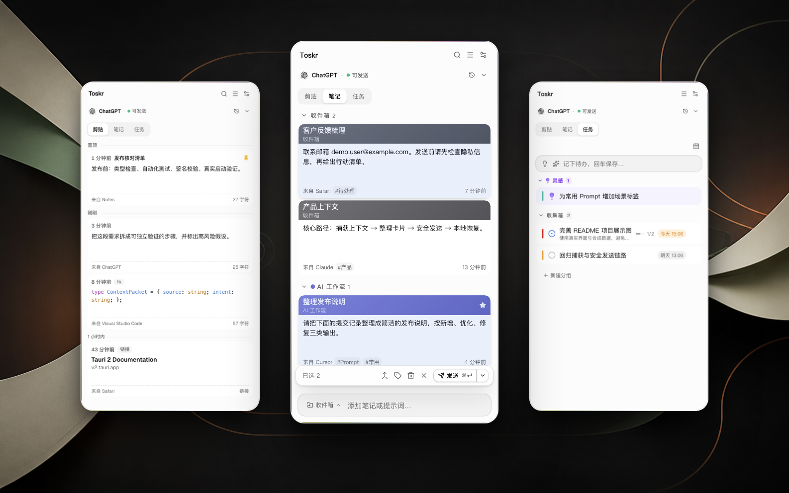

# Toskr

**AI 消息中转站**

把各个应用里的文字和图片收进来，整理、组合并检查隐私，再粘贴到当前 AI 输入框。

[官网](https://toskr.kaibin.me/) · [下载最新版](https://github.com/kristalderoyysi54/toskr/releases/latest) · 简体中文 · [English](README.en.md)

> **来源应用里的文字和图片** → **Toskr 收集、整理和隐私检查** → **当前 AI 输入框**

可为每个目标应用自定义自动提交——`⌘ Enter` 粘贴即送达。

  

## 三步上手

1. **收进来** 选中文字后双击 `⇧ Shift`。复制过的文字和图片也会进入剪贴板历史。
2. **整理好** 选择一张或多张卡片，调整顺序，组成这次要用的一组内容。需要时先处理文字或图片里的隐私。
3. **粘贴过去** 先点进目标应用的输入框，再打开 Toskr 按 `⌘ Enter`。Toskr 会切回该应用并粘贴；开启自动提交的应用，回车也一并完成。

  

剪贴板历史 · 卡片整理 · 任务提醒

## 核心能力

- **跨应用收集** 捕获任意应用中选中的文字，也能取回剪贴板历史里的文字和图片
- **多项内容一起准备** 选择多张文字或图片卡片，按当前顺序组成一次投递
- **粘贴前检查文字隐私** 在本机识别邮箱、IP、手机号、密钥等支持的敏感文字，需要时替换后再粘贴
- **处理图片中的敏感文字** 使用本地 OCR 找出支持识别的区域，并在发送副本上遮挡，原图保持不变

## 顺手能力

- **剪贴板历史** 默认保留 30 天，可随时暂停
- **笔记和任务** 暂存 Prompt、资料和待办，Toskr 运行时会提醒到期任务
- **面板停靠** 可固定在屏幕右侧或下方，也可开启左右伴随模式
- **按需扩展** 消息工作台、秘文、订阅提醒和 AI 助手默认关闭，需要时再开启

## 使用边界

- Toskr 识别的是目标应用，不是具体聊天、窗口或浏览器标签页。粘贴前请确认当前输入框。
- 图片 OCR 只处理支持识别的敏感文字，不识别人脸、二维码或所有视觉隐私。
- 核心记录与隐私处理默认在本机，无账号、无遥测。可选 AI、远程图片、链接摘要、汇率和更新检查等功能可能联网。
- 剪贴板捕获和任务提醒只在 Toskr 运行时工作。

## 安装

需要 **macOS 13 或更高版本**。

1. 从 [最新 Releases](https://github.com/kristalderoyysi54/toskr/releases/latest) 下载 `.dmg`，拖入 `Applications`。
2. 首次启动时使用**右键 →「打开」**，以打开自签名应用。
3. 按引导在「系统设置 → 隐私与安全性」中授予两项权限。
   - **辅助功能** 用于读取所选文字、切回目标应用并执行粘贴
   - **输入监控** 用于识别全局双击 `⇧ Shift`

应用内置自动更新，也可在「设置 → 关于」中手动检查。

## 快捷键

| 按键 | 作用 |
| --- | --- |
| 双击 `⇧ Shift` | 有选中文字时收进 Toskr，无选中时呼出或收起面板 |
| `⌘ Enter` / `⌘ 1-9` | 粘贴已选卡片 / 快速粘贴第 N 张卡片 |
| `⌘ F` · `Esc` | 搜索 · 逐层退出 |
| 长按 `⌥ Option` | 打开完整快捷键速查层 |

## 致谢与许可

灵感来自 [shadcn](https://github.com/shadcn) 的 Copper。[Apache License 2.0](LICENSE)
