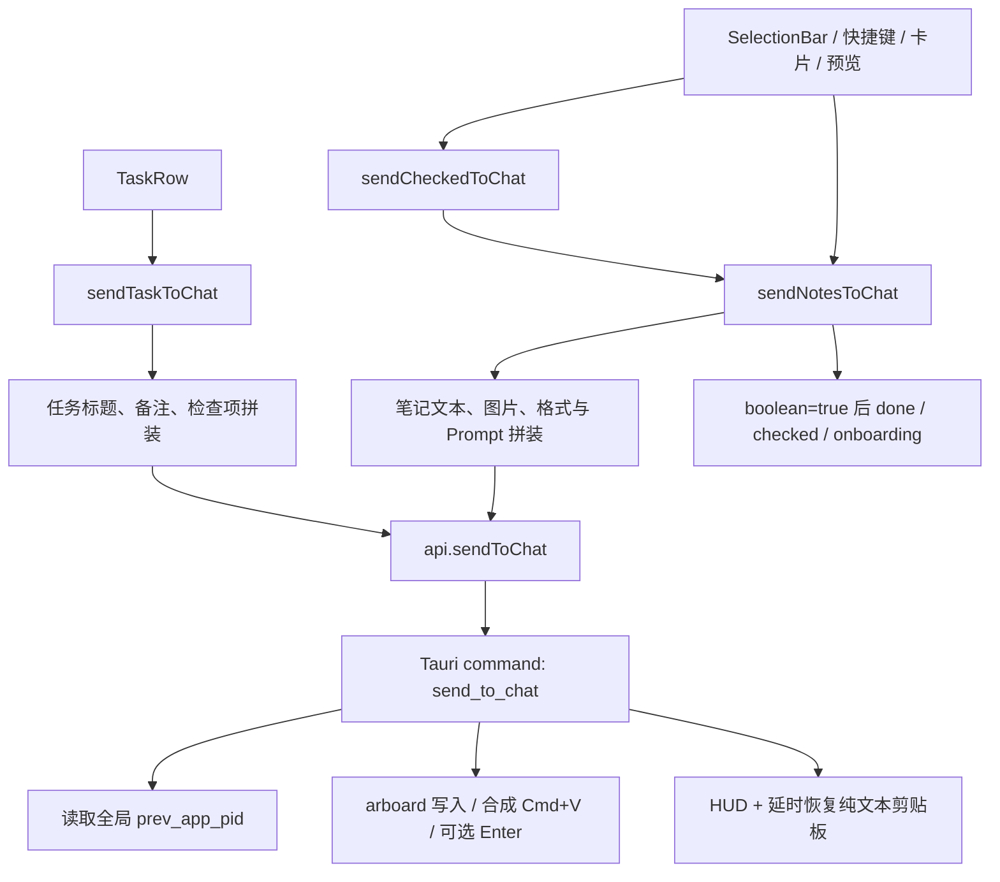
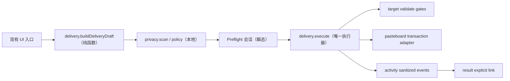

# Context Router 实现基线与架构契约

> Phase 00｜文档基线日期：2026-08-08（Asia/Shanghai）
> 本文只描述当前真实工作树并约束后续实现，不代表缺口已经修复。

## 1. 基线与证据边界

### 1.1 五层证据

| 层级 | 当前证据 | 可以证明 | 不能证明 |
|---|---|---|---|
| GitHub 独立审计基线 | `main@e000aa31413a8fc2b022e9ed9a5ac0505fdcee18`（v0.13.0） | 上一轮独立审计的固定起点 | 当前 checkout 和用户未提交修复 |
| 本地已提交源码 | `main@abd0c5929cca85def24f2badabe3ccbee7771e9f`（v0.14.0），与 `origin/main` 一致 | 当前已提交实现；Phase 02A 收口时另有 36 个 tracked 修改与 28 个 untracked 路径 | 未提交文件是否应进入下一提交 |
| 本地未提交工作树 | 见 1.2 | 当前用户正在进行的 DMG/发布材料改动与本地产物 | 这些改动的完成度或归属意图 |
| QA 台账 | `outputs/019fd7a4-0239-7812-a702-9db17e70a926/toskr-functional-spec-and-qa.xlsx` | 历史故事、缺陷和运行记录 | 当前工作树上的原生行为已回归 |
| 本轮运行证据 | 见 10.1 | 当前机器上自动门禁与构建是否可复现 | 未实际操作的跨应用、权限、剪贴板竞态行为 |

结论必须带证据层级。本文用 `CODE-CONFIRMED` 表示当前源码已确认，用
`QA-RECORDED` 表示工作簿历史记录，用 `RUNTIME-REQUIRED` 表示仍需真实 macOS
应用交互验证；三者不得互相替代。

### 1.2 当前 commit 与工作树

- 仓库根目录已确认包含 `package.json`、`src/`、`src-tauri/`。
- 当前分支：`main`。
- 当前 HEAD：`abd0c5929cca85def24f2badabe3ccbee7771e9f`。
- 固定基线 `e000aa3` 到 HEAD 的本地已提交变化集中在卡片编辑、分组拖拽、紧缩布局、预览/格式化与相关测试；不能用旧审计结果覆盖这些实现。
- 当前已有的 tracked 修改（本阶段未触碰）：
  - `.gitignore`（在本轮验证期间 11:01:09 出现的并行/外部修改，仅新增 `/AGENTS.md` 忽略规则；归属未确认，已原样保留）
  - `README.md`
  - `script/release.sh`
  - `src-tauri/tauri.conf.json`
- 当前已有的 untracked 路径（本阶段未触碰）：
  - `.codex-work/`
  - `output/`
  - `outputs/`
  - `src-tauri/dmg/`

README/release/Tauri config 的 tracked diff 是 DMG 构建/发布方向的既有用户改动；
`tauri.conf.json` 当前还把 bundle 目标扩展为 app + dmg。`.gitignore` 是初始快照后出现的
独立并行变化。Phase 00 不评价这些文件是否应提交，也不运行 release 脚本。

### 1.3 QA 工作簿交叉核验

工作簿共 224 条故事：31 通过、164 部分通过、9 失败、20 阻塞；7 条缺陷均标为已关闭。
发送 16 条故事的历史回归记录为通过，但原生发送运行仍注明“无法检查目标输入框内容”，
因此当前投递正确性仍是 `RUNTIME-REQUIRED`。AI、数据相关故事多数为部分通过；权限有
4 条阻塞。

7 条已关闭缺陷在当前源码中均找到对应修复，未发现“台账已关闭、当前源码已回退”的
静态冲突：

| 缺陷 | 当前代码证据 |
|---|---|
| BUG-001 IconButton ref | `src/components/ui/icon-button.tsx:75-117` 使用 `React.forwardRef` |
| BUG-002 预览类型重算 | `src/lib/previewPayload.ts:5-24` 及其测试 |
| BUG-003 Markdown 视图 | `src/lib/markdown.ts:15-27` 及其测试 |
| BUG-004 备份遗漏 taskSections | `src/lib/backup.ts:6-18` 及其测试 |
| BUG-005 “四缘”文案 | `src/App.tsx:2174-2194` |
| BUG-006 panelOpacity 步进 | `src/SettingsView.tsx:189-215, 337-348` |
| BUG-007 设置控件可访问名称 | `src/SettingsView.tsx:319-497` 等现有 `aria-label` / `ariaLabel` |

这只能证明修复仍在源码中；当前构建的视觉、VoiceOver 和原生窗口行为仍需重新运行。
本阶段不修改 QA 工作簿。

## 2. 当前五大能力地图

| 能力 | 可复用支持（当前） | 重复/分叉 | 关键缺口 |
|---|---|---|---|
| Target Lens | 原生维护前台 PID；可查询 bundle/name；显示面板、全局热键、双击捕获和失焦刷新都会更新目标 | `lib.rs` 轮询、`window.rs`、`input/tap.rs`、`commands.rs` 都能写同一 PID | 没有不可变快照、generation、进程启动身份、窗口身份和统一有效性；主面板没有持续 Target Lens |
| Preflight Composer | SelectionBar 有文本 tooltip，PreviewOverlay/TextPreview 可从预览发出 | 任务与笔记分别拼装；各入口直接执行；预览和最终原生载荷没有同一 revision | 没有 `DeliveryDraft`、权威 finalText、stale 检查、确认会话或复杂投递策略 |
| Context Firewall | clipwatch 可忽略 Concealed/Transient 类型；OCR 使用本地 Vision；发送诊断只写计数 | 剪贴板隐私规则、AI 输入和发送输入分属不同路径 | 没有正文 finding、策略、脱敏、出站门禁；AI 可把正文直接发到外部 endpoint |
| Result Return | 捕获结果可以成为普通 Note；Note/Task 已有本地持久化 | 捕获内容和最近发送没有关系模型 | 没有 `ResultLink`、候选匹配、显式关联、核验或来源缺失语义 |
| Outcome Intelligence | HUD/tip 提供短时反馈；diag 有内存最近 50 条和追加日志 | HUD、tip、diag 都表达“发生了什么”，但生命周期和隐私模型不同 | 没有脱敏活动账本、重试恢复、留存/轮转或有时间戳的成效指标 |

现有能力不是五套可并行扩建的“服务”。后续应围绕一次投递纵向形成单一管线，UI 只消费
状态和契约，macOS 副作用收敛到原生 adapter。

## 3. 当前发送入口与调用图

### 3.1 入口清单

| 用户入口 | 当前位置 | 前端调用 | 原生终点 |
|---|---|---|---|
| SelectionBar 主发送按钮 | `src/components/SelectionBar.tsx:78-92` | `sendCheckedToChat()` | `send_to_chat` |
| SelectionBar 普通/代码/Prompt 菜单 | `src/components/SelectionBar.tsx:104-145` | `sendCheckedToChat(prefix, opts)` | 同上 |
| 卡片右键“发送到对话” | `src/components/NoteCard.tsx:259-264` | `sendNotesToChat([id])` | 同上 |
| 卡片双击直发 | `src/components/NoteCard.tsx:505-513` | 单条或 stashed 多条 `sendNotesToChat` | 同上 |
| 全局 `⌘Enter` | `src/App.tsx:1416-1423` | `sendCheckedToChat()` | 同上 |
| 全局 `⌘1…9` | `src/App.tsx:1425-1433` | `sendNotesToChat([id])` | 同上 |
| 剪贴页 Enter | `src/App.tsx:1525-1535` | `sendCheckedToChat()` | 同上 |
| PreviewOverlay 发送 | `src/components/PreviewOverlay.tsx:377-385` | `sendNotesToChat([id])` | 同上 |
| TextPreview 独立窗发送 | `src/TextPreviewView.tsx:434-438` → `src/App.tsx:963-978` | emit 后由 main 调 `sendNotesToChat` | 同上 |
| TaskRow 右键发送 | `src/components/TaskRow.tsx:414-420` | `sendTaskToChat(id)` | 同上 |

### 3.2 当前调用图



前端强类型封装位于 `src/lib/tauri.ts:105-115`，但返回值仍是 `boolean`。核心拼装分别位于
`src/lib/actions.ts:155-179`（任务）与 `src/lib/actions.ts:244-307`（笔记）；批量入口只是
`src/lib/actions.ts:300-307` 的薄封装。真正的系统副作用集中在
`src-tauri/src/commands.rs:105-229`，command 注册位于 `src-tauri/src/lib.rs:157-224`。

### 3.3 发送后状态语义

- 笔记只有在原生返回 `true` 时才调用完成/清选中/完成 onboarding；保留卡、保留分组和
  剪贴板分组由 `src/store/notesStore.ts:1527-1547` 排除。
- 任务发送不标完成，但 `sendTaskToChat` 当前忽略原生 boolean；用户反馈依赖 Rust HUD。
- TextPreview 的发送事件先关闭窗口，且不会自动保存仍在编辑但未提交的 draft；当前实际
  发送的是 store 中已保存文本。这是 P1 行为歧义，不在 Phase 00 修复。

## 4. 当前状态与持久化边界

### 4.1 原生目标状态

- `AppState.prev_app_pid: Mutex<Option<i32>>` 是唯一目标字段：
  `src-tauri/src/state.rs:90-93`。
- 每 250ms 的前台观察器会记录最近一个非 Toskr PID：
  `src-tauri/src/lib.rs:50-69`。
- 面板显示、输入 tap 和全局热键会再次覆盖它：
  `src-tauri/src/window.rs:247-259`、`src-tauri/src/input/tap.rs:186-195`、
  `src-tauri/src/commands.rs:400-413`。
- 前端失焦 300ms 后调用刷新：`src/App.tsx:845-874` →
  `src-tauri/src/commands.rs:477-485`。
- `prev_app_info` 只按 PID 返回 bundle/name：`src-tauri/src/commands.rs:464-475`。
- `wait_frontmost` 只比较 PID：`src-tauri/src/focus.rs:57-65`。

因此“目标”目前是一个会被持续改写的全局变量，而不是某次投递固定下来的身份。PID
复用、应用重启、窗口切换与快照时刻都无法表达。

### 4.2 剪贴板状态

- 发送前只通过 arboard 备份纯文本：`src-tauri/src/commands.rs:112-121`。
- 文本/图片逐次写入并合成粘贴：`src-tauri/src/commands.rs:157-199`。
- 1.5 秒后无条件恢复旧纯文本：`src-tauri/src/commands.rs:215-226`。
- clipwatch 通过 `pasteboard_self_count` 精确忽略自写：
  `src-tauri/src/state.rs:139,227`、`src-tauri/src/clipwatch.rs:36-40,89-106`。
- Concealed/Transient 类型过滤位于 `src-tauri/src/clipwatch.rs:52-69`。
- 捕获回退直接读取系统剪贴板：`src-tauri/src/capture.rs:40-137`。

当前没有 pasteboard 多 item / UTI 快照，也没有 compare-and-swap 恢复。`mark_self_write`
可作为事务所有权基础，但不是完整事务。

### 4.3 前端选择与会话状态

- `checkedIds` 与操作位于 `src/store/notesStore.ts:446-505, 897-907`。
- `orderedCheckedNotes` 在 `src/store/notesStore.ts:1559-1562` 计算真实顺序。
- `uiStore` 的面板、预览、权限、页面和临时 UI 状态位于
  `src/store/uiStore.ts:5-141`，不持久化。
- 当前没有 delivery revision、preflight session、target token、firewall confirmation 或
  retry session。SelectionBar tooltip 不是权威载荷快照。

### 4.4 持久化边界

- Zustand persist 当前 version 为 7：`src/store/notesStore.ts:582-1562`，迁移在
  `1461-1493`，partialize 在 `1494-1500`，merge 在 `1501-1523`。
- 仅持久化 `sections`、`notes`、`tasks`、`taskSections`、`settings`；`checkedIds`、UI
  临时状态和 undo 栈不落盘。
- 前端 400ms 防抖通过强类型 Tauri wrapper 写数据：
  `src/store/persistStorage.ts:17-36`、`src/lib/tauri.ts:159-160`。
- Rust 使用 `toskr-data.json.tmp` 后 rename：`src-tauri/src/storage.rs:95-105`；媒体另存于
  数据目录，相关入口见 `src-tauri/src/storage.rs:133-220`。
- 当前 `settings.aiApiKey` 是持久化 settings 的明文字段：
  `src/store/notesStore.ts:193-278, 416-420`。
- 当前没有 activity、delivery、result 或 outcome 的持久化 domain。

## 5. 建议模块边界

边界目标是高 leverage、低 surface area：组件不能各自拼最终正文，原生 adapter 不能把
macOS 细节泄露给业务层。

| 模块 | 唯一职责 | 公开 seam | 不得拥有 |
|---|---|---|---|
| `target` | 捕获不可变目标身份；验证存活、bundle、进程代次和前台状态 | `captureTarget()`、`validateTarget(token, gate)` | 正文、Prompt、发送后 UI |
| `delivery` | 构建单一 Draft、执行一次投递状态机、汇总结构化结果 | `buildDeliveryDraft()`、`executeDeliveryDraft()` | 隐私规则实现、活动 UI、正文持久化 |
| `privacy` | 本地确定性扫描、策略判定和瞬态脱敏 | `scanText()`、`applyRedaction()`、`evaluatePolicy()` | 网络、AI、原始值日志、redactionMap 持久化 |
| `activity` | 追加有限、可恢复、已脱敏的事件元数据 | `appendEvent()`、`listRecent()`、`prepareRetry()` | 正文副本、自动重试、Target token 复用 |
| `result` | 显式关联结果 Note、核验状态与来源关系 | `suggestLinks()`、`linkResult()`、`verifyResult()` | 结果正文副本、自动关联、自动宣称正确 |

建议原生 `target` / `delivery` 内再以 adapter 封装 NSWorkspace/AX、pasteboard 和合成输入。
`src/lib/actions.ts` 最终只做 source intent 到 Draft 的协调；所有入口调用一个
`executeDeliveryDraft`。新 command 仍须集中注册于 `src-tauri/src/lib.rs`，并只通过
`src/lib/tauri.ts` 暴露。



## 6. 结构化契约草案

以下是跨阶段的 schema 约束，不要求 Phase 00 创建源码类型。时间统一为 Unix ms；ID 为
本机生成的随机 UUID。涉及正文的结构只存在于内存，禁止进入 diag/activity/backup。

```ts
type TargetSnapshot = {
  schemaVersion: 1;
  token: string;                 // 原生进程内 opaque token；重启即失效
  generation: number;            // 单调递增，防旧快照复用
  capturedAtMs: number;
  source: "panel-open" | "manual-refresh" | "hotkey" | "input-tap";
  identity: {
    pid: number;
    bundleId: string;
    appName: string;
    processStartedAtMs: number;  // 或等价 audit token；不能只认 PID
  };
  window: { windowId: number | null } | null;
};

type DeliveryDraft = {
  schemaVersion: 1;
  id: string;
  revision: number;
  createdAtMs: number;
  source: {
    kind: "notes" | "task" | "clipboard" | "result";
    itemIds: string[];
    sourceRevisions: number[];
  };
  target: TargetSnapshot;
  profileId: string | null;
  promptSnippetId: string | null;
  format: "plain" | "code" | "prompt";
  finalText: string;             // transient：不得持久化或记录
  imageFiles: string[];          // 仅允许受控数据目录内的引用
  enterPolicy: "off" | "ask" | "on";
  preflight: "skip" | "required";
};

type SendDeliveryRequest = {
  schemaVersion: 1;
  requestId: string;
  draftId: string;
  draftRevision: number;
  targetToken: string;
  confirmedTargetGeneration: number;
  finalText: string;             // IPC transient
  imageFiles: string[];
  pressEnter: boolean;
  keepPanel: boolean;
  confirmedAtMs: number | null;
  privacyDecision: {
    scanRevision: number;
    unresolvedBlockFindingIds: string[];
    warnConfirmationId: string | null;
  };
};

type SendDeliveryResult = {
  schemaVersion: 1;
  requestId: string;
  deliveryId: string;
  status: "sent" | "blocked" | "partial" | "failed";
  reasonCode:
    | "ok"
    | "target_missing"
    | "target_exited"
    | "target_identity_changed"
    | "target_focus_drift"
    | "payload_invalid"
    | "image_unreadable"
    | "paste_failed"
    | "enter_suppressed"
    | "clipboard_restore_failed"
    | "internal_error";
  validatedTarget: {
    bundleId: string;
    appName: string;
    generation: number;
  } | null;
  steps: {
    textPasted: boolean;
    imagesRequested: number;
    imagesPasted: number;
    enterPressed: boolean;
  };
  clipboard: {
    status: "restored" | "skipped_user_change" | "not_needed" | "failed";
  };
  startedAtMs: number;
  finishedAtMs: number;
  retryable: boolean;
};

type FirewallFinding = {
  schemaVersion: 1;
  id: string;
  ruleId: string;
  category: "credential" | "token" | "email" | "phone" | "account" | "custom";
  severity: "info" | "warn" | "block";
  range: { start: number; end: number; unit: "utf16" };
  maskedPreview: string;         // 只保留不可逆最小提示
  detectorVersion: string;
};

type DeliveryEvent = {
  schemaVersion: 1;
  id: string;
  deliveryId: string;
  atMs: number;
  phase: "prepared" | "blocked" | "sending" | "sent" | "failed" | "retry_prepared" | "result_linked";
  reasonCode: SendDeliveryResult["reasonCode"] | null;
  target: { bundleId: string; appName: string } | null;
  payloadStats: { characters: number; images: number }; // 不保存正文或可逆 hash
  privacyStats: { warnCount: number; blockCount: number; redactedCount: number };
  durationMs: number | null;
};

type ResultLink = {
  schemaVersion: 1;
  id: string;
  deliveryId: string;
  sourceItemIds: string[];
  resultNoteId: string;
  linkedAtMs: number;
  linkMethod: "user_selected";
  sourceState: "available" | "missing";
  resultState: "available" | "missing";
  verification: {
    status: "none" | "current" | "stale";
    reportNoteId: string | null;
  };
};
```

### 6.1 强制不变量

1. `TargetSnapshot` 一经生成不可变；每个 paste 和 Enter 前都由原生重新验证完整身份。
2. target 缺失、过期、退出或身份漂移时，合成粘贴和 Enter 调用次数必须为 0。
3. `status === "sent"` 才能完成卡片、清选择或完成 onboarding；图片少发必须是
   `partial`/`failed`，不能静默成功。
4. `DeliveryDraft.finalText`、`SendDeliveryRequest.finalText`、命中原值、redactionMap、API
   key、完整 Prompt 只存在于所需最短生命周期的内存/IPC。
5. `DeliveryEvent` 和 `ResultLink` 只存元数据；活动记录不是正文影子库。
6. retry 必须以当前 source 重新建 Draft、重新扫描、重新捕获目标，不复用旧 token。
7. 所有用户确认只绑定同一个 `{draftId, revision, targetGeneration}`；任一变化即失效。

## 7. Store 与数据迁移顺序

当前真实 store version 是 7。后续按阶段串行推进，禁止多个阶段抢用同一 version：

| 顺序 | 阶段 | 建议 schema 动作 | 兼容/回滚门禁 |
|---|---|---|---|
| 1 | 02A | 先建立完整目录/媒体备份 manifest，不急于增加业务字段 | 完整备份、hash、revision、故障注入和 rehydrate 通过前停止后续持久化 |
| 2 | 04 | v9：增加 `targetProfiles`、`promptGroups`，保留原 `promptSnippets` | 缺失字段给安全默认；重复 bundle 确定性处理；旧 snippet 文本/顺序不丢 |
| 3 | 09 | v9：把 legacy `aiApiKey` 事务性迁入 Keychain | Keychain 写入并回读成功后才删 JSON；失败时保留唯一副本并阻止覆盖；备份始终排除 key |
| 4 | 11 | activity 使用独立、带 schema 的 append/轮转文件；settings 如新增留存策略则升 v10 | 单行损坏可跳过；正文/secret 禁止进入；清活动不触碰业务数据 |
| 5 | 12 | v11：只增加 `resultLinks` 元数据 | Note 本体不搬迁；重复 link ID 确定性去重；来源/结果缺失可表达 |
| 6 | 14 | v12：增加指标开关、留存和用户基线 | 默认关闭虚假 ROI；缺少用户基线时不产生“节省时间” |

每次迁移必须幂等，接受字段缺失和未知字段，并在 merge 时深合并默认 settings。数组按稳定
ID 去重，冲突规则写入测试；不认识的未来字段读取时容忍、当前版本写回时只序列化已知白名单。
迁移失败不得用默认空状态覆盖旧文件。任何数据目录、媒体或 backup 变更都先经过 02A。

## 8. 自动化与原生手测矩阵

| 边界 | 自动化（不碰用户通用剪贴板/真实 AI） | 原生手测 | 状态 |
|---|---|---|---|
| Target identity | Rust fake adapter：missing/exited/PID 复用/focus drift；TS result reducer | App A→Toskr→App B，粘贴前和 Enter 前切换 | 后续 01；当前 `RUNTIME-REQUIRED` |
| Pasteboard transaction | 命名 pasteboard/纯函数 fixture：text、RTF、HTML、PNG、file URL、多 item、changeCount | 发送期间复制新内容；富文本/图片/文件往返 | 后续 02；当前 `RUNTIME-REQUIRED` |
| Data/media | 临时目录、hash manifest、故障注入、迁移/回滚/rehydrate | 自定义目录切换、完整备份恢复、媒体撤销 | 后续 02A；当前 `RUNTIME-REQUIRED` |
| Draft parity | Vitest table 驱动所有入口，比较 finalText bytes、图片顺序和 policy | 卡片/批量/任务/快捷键/两种预览逐一发送 | 后续 05 |
| Firewall | 纯函数正反例、Unicode UTF-16 范围、overlap、超限；command 无网络 | 高风险 block、warn 确认、占位替换与 stale | 后续 07–08 |
| AI security | URL validator、Keychain fake、argv 检查、错误脱敏；stub provider | Keychain 设置/删除、HTTPS/loopback、现有 AI 流程 | 后续 09–10 |
| Activity/retry | 损坏行、轮转、留存、重建 Draft、隐私扫描 | HUD 消失后查看失败并重新准备 | 后续 11 |
| Result/outcome | 显式 link、缺失源、stale report、聚合统计 | 捕获回答→关联→核验→采用标记 | 后续 12–14 |
| Accessibility/release | a11y queries、小窗口 overflow、全量门禁 | VoiceOver、全键盘访问、权限矩阵、首次演练 | 后续 15 |
| Image firewall | OCR fixture、坐标换算、临时副本生命周期 | Retina/缩放/多图/OCR 失败 | 可选 16 |

阶段级场景编号、证据字段和 fail-closed 规则见
`docs/context-router-qa-plan.md`。

## 9. 当前 P0 / P1 风险与阶段阻断

### 9.1 P0

| 风险 | 当前证据 | 阻断条件 |
|---|---|---|
| 无目标仍继续粘贴到当前前台应用 | `send_to_chat` 的 `target_pid=None` 不在 `src-tauri/src/commands.rs:123-156` 返回 | 阶段 01 未使 missing target 为 0 次合成输入，不得进入 02/03 |
| 仅验证 PID；PID 复用/身份漂移不可识别 | `state.rs:90-93`、`focus.rs:57-65` | 阶段 01 必须验证 pid + bundle + process generation/audit identity |
| 多图过程中重新聚焦失败后仍可能继续粘贴/回车 | `commands.rs:172-203` 缺少每次副作用后的统一 gate | 阶段 01 必须逐 paste、Enter 前 fail-closed |
| 延时恢复只保留纯文本且会覆盖用户新复制 | `commands.rs:112-115, 215-226` | 阶段 02 必须完整 snapshot + changeCount 所有权检查 |
| 不可读图片被静默丢弃，boolean 仍可能成功 | `commands.rs:117-121` 的 `filter_map` | 阶段 01/02 必须结构化 partial/failed；前端不得标完成 |
| API key 明文落盘并出现在 curl argv；非 loopback HTTP 未阻止 | `notesStore.ts:270,416`、`ai.rs:64-75,118-125` | 阶段 09 完成前不得扩展 AI 转换；阶段 08 前不得自动外发 |

### 9.2 P1

- 目标状态由四类入口写同一个 PID，Target Lens 容易显示与某次投递不同的状态。
- `target_pid=None` 的 HUD 文案声称“内容已在剪贴板”，但该分支尚未写入剪贴板：
  `src-tauri/src/commands.rs:137-156`。
- TextPreview 未保存 draft 即发，可能发送旧正文。
- HUD 与 `pendingUndo` 都是单槽：`src/lib/tip.ts:32-41`；后一次反馈会覆盖前一次，不能充当账本。
- diag 内存列表有上限但磁盘 `toskr-diag.log` 只 append、无轮转：
  `src-tauri/src/diag.rs:27-40`。
- AI provider 错误文案可能回显用户内容；`aiErrorTip` 只做长度截断，未做语义脱敏。
- `clipwatch.rs` / `state.rs` 注释称默认关闭，但当前 settings 默认开启，存在文档漂移。
- 当前没有直接覆盖 Zustand version 迁移的持久化 fixture；后续每个 version 必须新增迁移单测。

### 9.3 全局停止线

1. 01、02 或 02A 出现 P0、数据 hash 不一致、回滚失败时，停止后续阶段。
2. 05 前禁止再出现任何第二套最终正文拼装。
3. 08 前禁止新增自动发送或后台 AI 变换。
4. 09 前禁止新增 AI 能力；密钥和传输问题必须先清零。
5. 11 前禁止自动重试；11 后 retry 也只能重新准备，不能自动发送。
6. 14 的节省时间只有实测时长 + 用户基线才可计算。
7. 任一运行行为没有真实证据时标记 `RUNTIME-REQUIRED`，不能以静态代码或旧 QA 冒充通过。

## 10. Phase 00 基线验证

### 10.1 自动命令（2026-08-08）

| 命令 | 结果 | 证据摘要 |
|---|---|---|
| `pnpm typecheck` | PASS（exit 0，4.2s） | `tsc -b` 无错误 |
| `pnpm test` | PASS（exit 0，1.7s） | 16 files、188 tests 全通过；Vitest 运行 760ms |
| `pnpm lint` | PASS WITH WARNINGS（exit 0，0.5s） | 3 条既有 `react(only-export-components)`：PreviewOverlay、NoteCard、button |
| `STRICT=1 pnpm check:tokens` | PASS（exit 0，0.6s） | 6 项硬护栏均为 0；手写 button 86 仅为观察指标 |
| `(cd src-tauri && cargo test)` | PASS WITH WARNINGS（exit 0，2.4s） | 36 tests 全通过；focus/OCR 共 10 条既有 `unnecessary unsafe` 警告 |
| `pnpm build:app` | PASS（exit 0，123.8s） | Vite 2580 modules；本地签名 App、DMG、updater archive/signature 均生成 |
| `git diff --check` | PASS（exit 0） | 无 whitespace error |

构建保留的非阻断警告：bundle identifier 以 `.app` 结尾；dialog plugin 同时静态/动态
import；主 JS chunk 1,785.41 kB（gzip 578.42 kB）；未配置 Apple notarization 凭据，
因此只验证本地签名与 bundle，不声称已 notarize 或可发布。

### 10.2 手动与运行时

- Phase 00 不改变 UI 或数据，未新增业务手测。
- 已执行 `pkill -x toskr`：旧 PID 49773 退出；随后打开本轮 bundle，新 PID 69078 于
  2026-08-08 11:00:39 +08:00 启动。
- 新二进制 SHA-256：
  `fc30d5d0ed9a9d6d3c1e8f5e99091467b24bbf403e2cd9817627221974f192ce`。
- 前端资源键：`index-DUa89Bnd.js`；`codesign --verify --deep --strict` 通过。
- `toskr-diag.log` 的第 9091 行记录 `启动 v0.14.0 pid=69078`，与进程证据一致。
- “open 成功/进程存在”只证明应用可启动，不证明目标验证、粘贴、回车、剪贴板恢复、
  权限或 VoiceOver 行为。
- 上述跨应用行为全部保留为 `RUNTIME-REQUIRED`，由后续阶段的原生 QA 场景收口。

## 11. Phase 00 不变项

- 不修改 `src/`、`src-tauri/`、产品配置、版本号或 QA 工作簿。
- 不修复本文发现的缺陷，不创建 command/store/feature flag，不设计最终视觉稿。
- 用户界面、已有数据 schema 和运行行为保持不变。
- 不执行 git add、commit、push、分支切换、stash、reset、rebase 或 release。

## 12. Phase 01 实现增量（2026-08-08）

> 本节是 Phase 01 后的当前事实；第 2、3、9 节保留 Phase 00 的历史问题快照，涉及发送
> 现状时以本节为准。

### 12.1 CODE-CONFIRMED

- `src-tauri/src/target.rs` 已将发送目标从共享 PID 提升为不可变 snapshot/token：身份包含
  PID、bundle ID、进程启动时间、原生 generation 与捕获时间。当前无法稳定取得目标编辑
  窗口身份，因此 `windowId=null`，不伪造窗口级保证。
- 前台观察器只更新“下一次投递”的目标；同一进程身份保持 token。一次投递开始后固定持有
  原 snapshot，观察器后续切换目标不会改变本次 gate 的比较对象。
- `get_target_snapshot`、`refresh_target_snapshot`、`validate_target_snapshot` 和
  `send_delivery` 已注册并由 `src/lib/tauri.ts` 强类型封装。旧 `send_to_chat` 仅组装新请求
  并委托同一执行器。
- `src-tauri/src/delivery.rs` 在接收请求、每次真实 paste、自动 Enter 前验证 token、PID、
  bundle、launch identity 与 frontmost；每个 gate 还会确认冻结 token 仍是观察器的当前 token。
  图片预读后，隐藏面板前与真正激活旧目标紧前都只允许前台仍是 Toskr 或冻结目标，
  A→B 漂移不会被重新激活 A 掩盖。失败返回 `sent | blocked | failed`，不继续生成后续
  键盘事件。
- 图片附件在隐藏窗口和合成输入前全部预读；任一不可读即 `failed/image_unreadable`，不再
  由 `filter_map` 静默少发。
- 所有笔记、任务、单条、批量和快捷发送入口经 `actions.ts::deliver()` 调用同一原生契约。
  仅 `sent` 修改 done/checked/onboarding；blocked、failed、IPC 异常或无效回执会保留选择
  并恢复面板 store + 原生窗口。
- HUD 直接使用结构化 result.message；诊断只写 deliveryId、bundle/PID、status、reasonCode，
  不写正文、Prompt、图片路径或剪贴板内容。
- 前端 module gate 与原生 `delivery_in_flight` 双层阻止重复投递；原生 gate 覆盖 1.5s 延迟
  剪贴板恢复窗口，避免两个发送交错写 pasteboard 或合成重复按键。

### 12.2 自动证据与剩余边界

- Rust fake adapter 覆盖无 token、PID/bundle/launch 复用、退出、逐 paste gate、Enter 前焦点
  漂移、图片不可读、正常文本发送及稳定 reason 映射；自动测试不触碰 general pasteboard。
- Vitest 覆盖回执守卫、sent/blocked/failed 对 store 的差异，以及笔记/任务/单条/批量统一
  委托；异常或自相矛盾的“成功”回执 fail-closed。
- 未改变 Zustand schema/version，也未迁移持久化数据；autoEnter 默认仍关闭。
- Phase 01 延续旧实现的“仅备份纯文本、1.5s 后恢复”兼容边界，并通过
  `clipboardOutcome` 如实区分 unchanged / restore_scheduled / payload_retained。完整多类型
  snapshot 与 changeCount CAS 仍由 Phase 02 完成；在此之前，富剪贴板与发送期间新复制
  内容仍是 P0 `RUNTIME-REQUIRED` 风险。
- 正常发送、目标退出、Pin 切换、paste 后抢焦点、终端默认不 Enter 仍需用真实 macOS
  输入框验收；构建启动不能替代这些断言。

### 12.3 Phase 01 验证与运行指纹

| 命令 | 结果 | 证据摘要 |
|---|---|---|
| `pnpm typecheck` | PASS（exit 0） | `tsc -b` 无错误 |
| `pnpm test` | PASS（exit 0） | 19 files、207 tests 全通过 |
| `pnpm lint` | PASS WITH WARNINGS（exit 0） | 仅 3 条既有 `react(only-export-components)` 警告 |
| `STRICT=1 pnpm check:tokens` | PASS（exit 0） | 6 项硬护栏均为 0 |
| `cargo test --manifest-path src-tauri/Cargo.toml` | PASS WITH WARNINGS（exit 0） | 57 tests 全通过；保留 focus/OCR 的 10 条既有 `unnecessary unsafe` 警告 |
| `pnpm build:app` | PASS（exit 0，120.3s） | Vite 2580 modules；本地签名 App、DMG、updater archive/signature 均生成 |
| `git diff --check` | PASS（exit 0） | 无 whitespace error |

- 最终重建后已终止旧 PID 99977，并于 2026-08-08 12:17:36 +08:00 从本轮 bundle 启动
  PID 2934；`toskr-diag.log` 记录 `启动 v0.14.0 pid=2934`。
- 新二进制 SHA-256 为
  `fe915e16cc3fb27b18c7410b774fa1ca68ceb56c04b76586e7672aff99a2ec92`；前端资源键为
  `index-CLQuE2Jn.js`；`codesign --verify --deep --strict` 通过。
- 构建保留 bundle identifier、主 chunk、dialog import 与未 notarize 警告；只证明本地
  构建、签名与启动成功，不声明可发布，也不替代五项跨应用原生手测。
- 本阶段未执行 git add/commit/push、分支切换、stash/reset/rebase、release、版本修改或
  外部发布。

## 13. Phase 02 实现增量（2026-08-08）

> 本节是 Phase 02 后的当前事实；第 12.2 节所述“纯文本备份 / 旧 clipboardOutcome”边界
> 已被本节替代。Phase 00/01 其余历史证据继续保留。

### 13.1 CODE-CONFIRMED

- 新增 `src-tauri/src/pasteboard.rs`：快照按原顺序保存每个 pasteboard item、每个 UTI/type
  与原始 bytes，并以读取前后稳定的 `changeCount` 接受快照；内容不进入 diag 或错误消息。
- `PasteboardTransaction` 只认 `clearContents()` 返回的精确下一 generation，并要求写后仍是
  同一 generation；文本、图片、多图与恢复均更新已证明的 owned count。恢复只执行一次，
  用户/其他应用已写入时返回 `skippedUserChanged`，不会用旧快照覆盖。
- 发送、捕获回退、剪贴板 watcher、显式复制文本/图片共享一个 RAII 事务许可。watcher 拿不到
  许可时不推进 `last_seen`；许可释放前以事务保存的精确 generation 标记 self-write，不会在
  恢复 R→用户 U 的窗口把 U 误标为 Toskr。
- 发送链路按“目标预检 → payload staging/PNG 编码与 pasteboard 写入 → 目标复检 → ⌘V”执行；
  ⌘V 前后还各复核一次 pasteboard ownership。任一目标或剪贴板漂移都会停止后续 paste/Enter，
  并在仍拥有 generation 时立即恢复。
- 成功发送保留 1.5s 兼容等待，再按所有权恢复。结构化结果精确区分 `restored`、
  `skippedUserChanged`、`nothingToRestore`、`restoreFailed`、`notOwned`；HUD 直接消费同一
  `result.message`。
- 捕获优先 AX 直读（零 pasteboard 写入）。回退路径冻结前台 PID/bundle/launch identity 与
  非 Toskr 合成的真实输入 generation，只接受前 500ms 内唯一稳定的下一 revision；随后
  500ms 是只恢复、不采纳 payload 的迟到宽限窗。读取前后 generation 或上下文漂移会丢弃
  payload；已安全认领且 generation 未变时仍恢复原快照。
- Enigo 合成事件写入固定 `EVENT_SOURCE_USER_DATA` marker，CGEventTap 不把它计入真实输入代数；
  键盘与鼠标按下会推进真实输入 generation。
- 未修改 Zustand 持久化 schema/version，没有数据迁移或历史数据重写。

### 13.2 自动证据

| 命令 | 结果 | 证据摘要 |
|---|---|---|
| `pnpm typecheck` | PASS（exit 0） | `tsc -b` 无错误 |
| `pnpm test` | PASS（exit 0） | 19 files、217 tests 全通过 |
| `pnpm lint` | PASS WITH WARNINGS（exit 0） | 仅 3 条既有 `react(only-export-components)` 警告 |
| `STRICT=1 pnpm check:tokens` | PASS（exit 0） | 6 项硬护栏均为 0 |
| `cargo test --manifest-path src-tauri/Cargo.toml` | PASS WITH WARNINGS（exit 0） | 88 tests 全通过；保留 focus/OCR 的 10 条既有 `unnecessary unsafe` 警告 |
| `pnpm build:app` | PASS（exit 0，127.3s） | Vite 2580 modules；签名 App、DMG、updater archive/signature 均生成 |
| `git diff --check` | PASS（exit 0） | 无 whitespace error |

Rust 测试只使用命名 pasteboard、纯 generation 状态机与 fake runtime，不破坏 general
pasteboard。覆盖 text/RTF/HTML/PNG/file URL/未知 UTI/空表示/多 item 往返、连续图片、用户
改写、clear/write 插入 generation、恢复失败单次终止、精确 self marker、迟到复制、真实输入
漂移、staging 期间目标漂移及 paste 前后所有权门。命名 pasteboard 在测试线程会输出 AppKit
“synchronous promise fulfillment requested from a background thread”提示；断言全部通过，真实
TextEdit/Finder/Preview provider 行为仍需原生手测。

### 13.3 构建与运行指纹

- 最终包构建后终止旧 PID 2934；第一次 `open` 在旧进程退出窗口返回 LaunchServices `-600`，
  确认旧 PID 已消失后重试成功。新 PID 46047 于 2026-08-08 13:55:20 +08:00 从本轮 bundle
  启动，`toskr-diag.log` 第 9162 行记录 `启动 v0.14.0 pid=46047`。
- App 二进制 SHA-256：
  `c829a01f33ade01e6d9130360a685ce86b23bbc1ec7de786e8ae026f2ec11f9b`；前端资源键为
  `index-s37iuxwa.js` / `index-m3zcfMgp.css`。
- DMG SHA-256：`660ad3732e3cdcd60edeb7b9b2d5e7817490aaf6bfc155a62c745a2787f83570`；
  updater archive SHA-256：`a183132ce6e14bfe013293493df8b2103b43a0598a44cc48952289add16415e1`。
  `codesign --verify --deep --strict` 与 `hdiutil verify` 均通过。
- 构建仍有既有 bundle identifier `.app`、dialog 静态/动态 import、1.79MB 主 chunk 与未
  notarize 警告；只证明本地构建、签名、DMG 完整性和启动成功，不声明可发布。

### 13.4 RUNTIME-REQUIRED 与已知边界

- `NSPasteboard.changeCount` 不提供通用 writer PID。目标无选区且后台 writer 恰好只写一次、
  前台身份和真实输入均不漂移时，单一 N+1 与目标响应不可区分；当前是 best-effort，不声称
  证明 writer provenance。
- 若真实输入先漂移、候选 revision 后出现，该 N+1 可能是迟到合成复制，也可能是用户 Copy；
  两者不可观测。实现优先保留用户新内容并放弃恢复，因此极端情况下原快照可能被迟到写入
  替换。盲目恢复会违反“不得覆盖用户新复制”的更高优先级约束。
- ownership/target 后检与 macOS 实际消费 CGEvent 之间仍存在 OS 级微小窗口，无公开 CAS 可把
  pasteboard generation、目标焦点与事件消费原子绑定。
- TextEdit 富文本、Finder 多文件、Preview 图片、发送后 100/500/1400ms 用户复制、无选区/
  >500ms 迟到捕获、慢速聊天应用六组真实场景尚未执行，统一标记 `RUNTIME-REQUIRED`。
- 本阶段未执行 git add/commit/push、分支切换、stash/reset/rebase、release、版本修改或
  外部发布。

## 14. Phase 02A 实现增量（2026-08-08）

> 本节是 Phase 02A 后的数据事实；第 1–9 节仍保留 Phase 00 的审计快照，涉及目录、
> 持久化、备份和媒体现状时以本节为准。

### 14.1 CODE-CONFIRMED

- `data_integrity.rs` 将目录操作收敛为带 operation ID 的两阶段事务。预检区分 missing、empty、
  non-Toskr、valid、corrupt、unsupported、read-only、same-path、嵌套路径与同步目录风险；
  两个有效数据集只允许 load、cancel 或创建 recovery 后显式 replace，不做 record merge。
- 事务在首次破坏性动作前持久化并 fsync journal，记录旧指针、source/target、冻结 revision、
  recovery/staging、cleanup 与阶段。启动和 WebView reload 都先处理 pending operation；journal
  未恢复时普通写、完整导入、图片保存和媒体 GC fail-closed。
- forward commit 与 rollback 都先把将被替换的受管版本搬入 displaced/capture，再以完整 manifest
  验证身份。崩溃留下的 target、staging、displaced、rollback capture/recovery partial 只在精确
  union 可证明属于本事务时续接；外部新增、删除或替换版本会保留目标与 journal，不静默覆盖。
- 目录 inspection 返回 managed revision，plan 冻结用户确认的目标版本；完整/legacy 备份 inspection
  返回 archive revision。确认窗中 A 被同 schema 的 B 替换时，Native 重新校验并返回
  `externalConflict`，不会按 A 的数量执行或报告 B。
- `persistStorage.ts` 使用业务文件 SHA-256 revision 做防抖写 OCC；pause 即使没有 pending write 也会
  强制复核当前磁盘。冲突进入 durable Native marker 与全局只读态，Settings 可执行 reload、
  recovery backup 或暂不处理；main 再次权威拦截迟到的 Settings patch。
- Zustand store version 升至 8。统一 decoder 对字段缺失使用稳定默认、保留未知字段，旧 version
  稳定去重；当前 schema 的错误类型、非法枚举和重复 domain/checklist ID fail-closed。数据切换后
  使用目标真实持久域替换内存，只有磁盘仍等于事务前 A 时才恢复 checked/undo 等 transient。
- store persist 使用 `skipHydration`。启动协调器先查询 Native status：无 pending 才显式 hydrate；
  有 pending 则唯一续接路径完成 rehydrate/finalize 或 rollback。数据 generation 使 delivery、AI、
  OCR、link meta、预览、草稿图片、撤销和后台 GC 的异步完成不能穿透目录切换。
- rehydrate 会等待热键、clip watcher、主题、透明度、边栏等运行时设置整批下发；任一失败进入
  rollback，并等待旧设置全部恢复后再解锁。解锁后发布 runtime-ready，补跑冻结期间跳过的提醒、
  剪贴清理和启动 GC。
- 存储初始化不再因离线/损坏自定义指针直接终止应用，也不静默回默认目录。recovery-only 状态
  显示稳定 code 与 configured path，只开放重试、明确加载默认或选择另一个 valid target；普通
  业务写保持只读。
- `.toskr-backup` 为版本化 ZIP，包含 manifest、v9 业务状态、四个内容域、允许的 settings 与所有
  被引用媒体的 hash/size/path；禁止 secret、绝对/穿越路径、symlink、重复路径、超限和实际流量
  膨胀。导入在隔离 staging 二次校验 size/SHA 后才进入同一可回滚目录事务。
- 完整导出在冻结前后验证业务 revision，发布目标使用 owned inode/revision，外部替换不会被误删或
  报成功。冲突恢复副本还要求内容寻址媒体文件名与实际解码像素身份一致；无法证明时拒绝生成
  “内存 A + 媒体 B”的混合归档。旧 JSON 保留兼容 merge，但明确缺媒体/taskSections 能力并在
  commit 后独立生成健康报告。
- 媒体删除改为持久墓碑和延迟 GC。active、共享、undo、业务磁盘与运行时引用取并集；文件墓碑
  绑定 SHA-256 generation，重复排期只延长 deadline。GC 在 rename 前持久化 deterministic quarantine，
  批次任一冲突会逆序回放，journal/rename/unlink 三种崩溃点重启均能恢复或完成。缺失和孤立媒体
  只报告，不作为自动删除依据；派生 thumbs 不进入业务 revision/备份/事务 copy。
- 所有大文件 hash、copy、unzip 和健康检查 Tauri command 都在 blocking pool 执行；组件不散落裸
  `invoke`。数据 UI 沿用现有 HUD、设置状态与只读 guard，没有新增主 tab 或第三方 toast。

### 14.2 Data Migration 与兼容边界

- store version `7 → 8` 的迁移补齐 task/note/settings 缺失字段、稳定处理旧重复项与孤儿分组；
  unknown fields 保留。当前 v9 的 present-but-wrong-type 与重复 ID 不再静默归一为空。
- 旧 `toskr-store.json` 只在 durable initialization marker 尚不存在的首次迁移读取；完成后新数据
  文件 missing 被视为冲突，不能再次复活陈旧 legacy 快照。
- AI API key 不进入完整或冲突恢复备份；完整恢复后 UI 明确要求重新配置。本阶段没有自动合并
  两个有效数据集，没有删除损坏用户数据，也没有更改应用版本号。

### 14.3 自动证据与运行指纹

| 命令 | 结果 | 证据摘要 |
|---|---|---|
| `pnpm typecheck` | PASS（exit 0） | `tsc -b` 无错误 |
| `pnpm test` | PASS（exit 0） | 25 files、263 tests 全通过 |
| `pnpm lint` | PASS WITH WARNINGS（exit 0） | 仅 3 条既有 `react(only-export-components)` |
| `STRICT=1 pnpm check:tokens` | PASS（exit 0） | 6 项硬护栏均为 0 |
| `(cd src-tauri && cargo test)` | PASS WITH WARNINGS（exit 0） | 148 tests 全通过；10 条既有 `unnecessary unsafe` |
| `pnpm build:app` | PASS（exit 0，132.9s） | Vite 2588 modules；App、DMG、updater archive/signature 均生成 |
| `codesign --verify --deep --strict` | PASS（exit 0） | 本地 `Toskr Dev Signing` 签名有效 |
| `hdiutil verify` | PASS（exit 0） | DMG CRC 校验有效 |
| `git diff --check` | PASS（exit 0） | tracked diff 无 whitespace error |

- 构建后终止旧 PID 46047，并于 2026-08-08 18:13:14 +08:00 从本轮 bundle 启动 PID 37464；
  `toskr-diag.log` 第 9177 行记录 `启动 v0.14.0 pid=37464`。
- App 二进制 SHA-256：
  `f55d0c625dd5a51d485e0f8de2043a4721df8987ec9a4e172695259215f25f9c`；前端资源键为
  `index-DAmFXona.js` / `index-CS9ZXxsn.css`。
- DMG SHA-256：`a782ed030ac84360848b78f332930a2f988fcb79d02870c4f8de935e5be692d7`；
  updater archive SHA-256：`188284c53494699d2b517997a92dd337f140eca8f10a25002e388a7b0c704cf1`。
- 两轮独立只读规格/代码复核在最终稳定树未发现剩余 Phase 02A 实现级 P0/P1。

### 14.4 RUNTIME-REQUIRED 与已知边界

- 自动测试全部使用临时目录、synthetic JSON/ZIP/PNG、fake failure seam 与命名 pasteboard；没有
  对真实用户数据目录执行切换、迁移、导入或显式 GC。
- 文档要求的最终 bundle 启动会读取当前配置并追加启动诊断；本轮没有启动前的数据 hash，故不
  声称真实活动目录字节完全未变，只确认未主动执行任何破坏性数据场景。
- 空目录迁移并立即重启、加载已有 valid target、恢复默认目录、外部同步冲突三出口、全新目录
  完整恢复、图片历史删除后撤销，以及 recovery-only 的真实挂载恢复尚未执行，统一标记
  `RUNTIME-REQUIRED`。
- 文件系统没有公开的跨多文件原子事务；实现以 durable journal、no-clobber rename、完整 manifest
  身份和 fail-closed recovery 收口。断电、网络盘和同步盘的真实时序仍需在隔离副本上做 fault QA，
  不能以 148 个单测替代。
- 冲突恢复副本只能证明当前内容寻址媒体；历史非内容寻址文件在冲突态无法证明身份时会拒绝
  “完整”导出，用户仍可选择 reload 或先恢复已知数据副本。这是保留用户新版本的刻意取舍。
- 构建仍有 bundle identifier `.app`、dialog 静态/动态 import、1.82MB 主 chunk 与未 notarize 警告；
  本轮只证明本地构建、签名、DMG 完整性和启动，不声明可发布。
- 本阶段未执行 git add/commit/push、分支切换、stash/reset/rebase、release、版本修改或外部发布。
