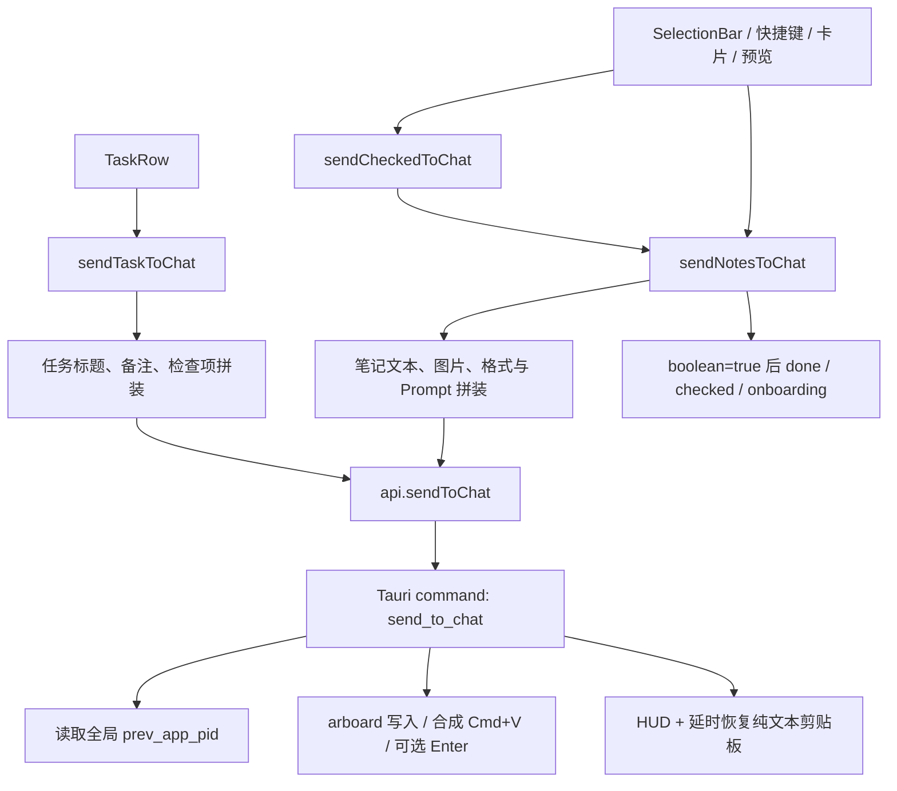
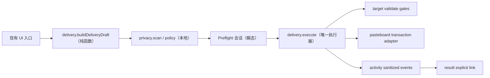

# Context Router 实现基线与架构契约

> Phase 00｜文档基线日期：2026-08-08（Asia/Shanghai）
> 本文只描述当前真实工作树并约束后续实现，不代表缺口已经修复。

## 1. 基线与证据边界

### 1.1 五层证据

| 层级 | 当前证据 | 可以证明 | 不能证明 |
|---|---|---|---|
| GitHub 独立审计基线 | `main@e000aa31413a8fc2b022e9ed9a5ac0505fdcee18`（v0.13.0） | 上一轮独立审计的固定起点 | 当前 checkout 和用户未提交修复 |
| 本地已提交源码 | `main@abd0c5929cca85def24f2badabe3ccbee7771e9f`（v0.14.0），与 `origin/main` 一致 | 当前已提交实现；Phase 02A 收口时另有 36 个 tracked 修改与 28 个 untracked 路径 | 未提交文件是否应进入下一提交 |
| 本地未提交工作树 | 见 1.2 | 当前用户正在进行的 DMG/发布材料改动与本地产物 | 这些改动的完成度或归属意图 |
| QA 台账 | `outputs/019fd7a4-0239-7812-a702-9db17e70a926/toskr-functional-spec-and-qa.xlsx` | 历史故事、缺陷和运行记录 | 当前工作树上的原生行为已回归 |
| 本轮运行证据 | 见 10.1 | 当前机器上自动门禁与构建是否可复现 | 未实际操作的跨应用、权限、剪贴板竞态行为 |

结论必须带证据层级。本文用 `CODE-CONFIRMED` 表示当前源码已确认，用
`QA-RECORDED` 表示工作簿历史记录，用 `RUNTIME-REQUIRED` 表示仍需真实 macOS
应用交互验证；三者不得互相替代。

### 1.2 当前 commit 与工作树

- 仓库根目录已确认包含 `package.json`、`src/`、`src-tauri/`。
- 当前分支：`main`。
- 当前 HEAD：`abd0c5929cca85def24f2badabe3ccbee7771e9f`。
- 固定基线 `e000aa3` 到 HEAD 的本地已提交变化集中在卡片编辑、分组拖拽、紧缩布局、预览/格式化与相关测试；不能用旧审计结果覆盖这些实现。
- 当前已有的 tracked 修改（本阶段未触碰）：
  - `.gitignore`（在本轮验证期间 11:01:09 出现的并行/外部修改，仅新增 `/AGENTS.md` 忽略规则；归属未确认，已原样保留）
  - `README.md`
  - `script/release.sh`
  - `src-tauri/tauri.conf.json`
- 当前已有的 untracked 路径（本阶段未触碰）：
  - `.codex-work/`
  - `output/`
  - `outputs/`
  - `src-tauri/dmg/`

README/release/Tauri config 的 tracked diff 是 DMG 构建/发布方向的既有用户改动；
`tauri.conf.json` 当前还把 bundle 目标扩展为 app + dmg。`.gitignore` 是初始快照后出现的
独立并行变化。Phase 00 不评价这些文件是否应提交，也不运行 release 脚本。

### 1.3 QA 工作簿交叉核验

工作簿共 224 条故事：31 通过、164 部分通过、9 失败、20 阻塞；7 条缺陷均标为已关闭。
发送 16 条故事的历史回归记录为通过，但原生发送运行仍注明“无法检查目标输入框内容”，
因此当前投递正确性仍是 `RUNTIME-REQUIRED`。AI、数据相关故事多数为部分通过；权限有
4 条阻塞。

7 条已关闭缺陷在当前源码中均找到对应修复，未发现“台账已关闭、当前源码已回退”的
静态冲突：

| 缺陷 | 当前代码证据 |
|---|---|
| BUG-001 IconButton ref | `src/components/ui/icon-button.tsx:75-117` 使用 `React.forwardRef` |
| BUG-002 预览类型重算 | `src/lib/previewPayload.ts:5-24` 及其测试 |
| BUG-003 Markdown 视图 | `src/lib/markdown.ts:15-27` 及其测试 |
| BUG-004 备份遗漏 taskSections | `src/lib/backup.ts:6-18` 及其测试 |
| BUG-005 “四缘”文案 | `src/App.tsx:2174-2194` |
| BUG-006 panelOpacity 步进 | `src/SettingsView.tsx:189-215, 337-348` |
| BUG-007 设置控件可访问名称 | `src/SettingsView.tsx:319-497` 等现有 `aria-label` / `ariaLabel` |

这只能证明修复仍在源码中；当前构建的视觉、VoiceOver 和原生窗口行为仍需重新运行。
本阶段不修改 QA 工作簿。

## 2. 当前五大能力地图

| 能力 | 可复用支持（当前） | 重复/分叉 | 关键缺口 |
|---|---|---|---|
| Target Lens | 原生维护前台 PID；可查询 bundle/name；显示面板、全局热键、双击捕获和失焦刷新都会更新目标 | `lib.rs` 轮询、`window.rs`、`input/tap.rs`、`commands.rs` 都能写同一 PID | 没有不可变快照、generation、进程启动身份、窗口身份和统一有效性；主面板没有持续 Target Lens |
| Preflight Composer | SelectionBar 有文本 tooltip，PreviewOverlay/TextPreview 可从预览发出 | 任务与笔记分别拼装；各入口直接执行；预览和最终原生载荷没有同一 revision | 没有 `DeliveryDraft`、权威 finalText、stale 检查、确认会话或复杂投递策略 |
| Context Firewall | clipwatch 可忽略 Concealed/Transient 类型；OCR 使用本地 Vision；发送诊断只写计数 | 剪贴板隐私规则、AI 输入和发送输入分属不同路径 | 没有正文 finding、策略、脱敏、出站门禁；AI 可把正文直接发到外部 endpoint |
| Result Return | 捕获结果可以成为普通 Note；Note/Task 已有本地持久化 | 捕获内容和最近发送没有关系模型 | 没有 `ResultLink`、候选匹配、显式关联、核验或来源缺失语义 |
| Outcome Intelligence | HUD/tip 提供短时反馈；diag 有内存最近 50 条和追加日志 | HUD、tip、diag 都表达“发生了什么”，但生命周期和隐私模型不同 | 没有脱敏活动账本、重试恢复、留存/轮转或有时间戳的成效指标 |

现有能力不是五套可并行扩建的“服务”。后续应围绕一次投递纵向形成单一管线，UI 只消费
状态和契约，macOS 副作用收敛到原生 adapter。

## 3. 当前发送入口与调用图

### 3.1 入口清单

| 用户入口 | 当前位置 | 前端调用 | 原生终点 |
|---|---|---|---|
| SelectionBar 主发送按钮 | `src/components/SelectionBar.tsx:78-92` | `sendCheckedToChat()` | `send_to_chat` |
| SelectionBar 普通/代码/Prompt 菜单 | `src/components/SelectionBar.tsx:104-145` | `sendCheckedToChat(prefix, opts)` | 同上 |
| 卡片右键“发送到对话” | `src/components/NoteCard.tsx:259-264` | `sendNotesToChat([id])` | 同上 |
| 卡片双击直发 | `src/components/NoteCard.tsx:505-513` | 单条或 stashed 多条 `sendNotesToChat` | 同上 |
| 全局 `⌘Enter` | `src/App.tsx:1416-1423` | `sendCheckedToChat()` | 同上 |
| 全局 `⌘1…9` | `src/App.tsx:1425-1433` | `sendNotesToChat([id])` | 同上 |
| 剪贴页 Enter | `src/App.tsx:1525-1535` | `sendCheckedToChat()` | 同上 |
| PreviewOverlay 发送 | `src/components/PreviewOverlay.tsx:377-385` | `sendNotesToChat([id])` | 同上 |
| TextPreview 独立窗发送 | `src/TextPreviewView.tsx:434-438` → `src/App.tsx:963-978` | emit 后由 main 调 `sendNotesToChat` | 同上 |
| TaskRow 右键发送 | `src/components/TaskRow.tsx:414-420` | `sendTaskToChat(id)` | 同上 |

### 3.2 当前调用图



前端强类型封装位于 `src/lib/tauri.ts:105-115`，但返回值仍是 `boolean`。核心拼装分别位于
`src/lib/actions.ts:155-179`（任务）与 `src/lib/actions.ts:244-307`（笔记）；批量入口只是
`src/lib/actions.ts:300-307` 的薄封装。真正的系统副作用集中在
`src-tauri/src/commands.rs:105-229`，command 注册位于 `src-tauri/src/lib.rs:157-224`。

### 3.3 发送后状态语义

- 笔记只有在原生返回 `true` 时才调用完成/清选中/完成 onboarding；保留卡、保留分组和
  剪贴板分组由 `src/store/notesStore.ts:1527-1547` 排除。
- 任务发送不标完成，但 `sendTaskToChat` 当前忽略原生 boolean；用户反馈依赖 Rust HUD。
- TextPreview 的发送事件先关闭窗口，且不会自动保存仍在编辑但未提交的 draft；当前实际
  发送的是 store 中已保存文本。这是 P1 行为歧义，不在 Phase 00 修复。

## 4. 当前状态与持久化边界

### 4.1 原生目标状态

- `AppState.prev_app_pid: Mutex<Option<i32>>` 是唯一目标字段：
  `src-tauri/src/state.rs:90-93`。
- 每 250ms 的前台观察器会记录最近一个非 Toskr PID：
  `src-tauri/src/lib.rs:50-69`。
- 面板显示、输入 tap 和全局热键会再次覆盖它：
  `src-tauri/src/window.rs:247-259`、`src-tauri/src/input/tap.rs:186-195`、
  `src-tauri/src/commands.rs:400-413`。
- 前端失焦 300ms 后调用刷新：`src/App.tsx:845-874` →
  `src-tauri/src/commands.rs:477-485`。
- `prev_app_info` 只按 PID 返回 bundle/name：`src-tauri/src/commands.rs:464-475`。
- `wait_frontmost` 只比较 PID：`src-tauri/src/focus.rs:57-65`。

因此“目标”目前是一个会被持续改写的全局变量，而不是某次投递固定下来的身份。PID
复用、应用重启、窗口切换与快照时刻都无法表达。

### 4.2 剪贴板状态

- 发送前只通过 arboard 备份纯文本：`src-tauri/src/commands.rs:112-121`。
- 文本/图片逐次写入并合成粘贴：`src-tauri/src/commands.rs:157-199`。
- 1.5 秒后无条件恢复旧纯文本：`src-tauri/src/commands.rs:215-226`。
- clipwatch 通过 `pasteboard_self_count` 精确忽略自写：
  `src-tauri/src/state.rs:139,227`、`src-tauri/src/clipwatch.rs:36-40,89-106`。
- Concealed/Transient 类型过滤位于 `src-tauri/src/clipwatch.rs:52-69`。
- 捕获回退直接读取系统剪贴板：`src-tauri/src/capture.rs:40-137`。

当前没有 pasteboard 多 item / UTI 快照，也没有 compare-and-swap 恢复。`mark_self_write`
可作为事务所有权基础，但不是完整事务。

### 4.3 前端选择与会话状态

- `checkedIds` 与操作位于 `src/store/notesStore.ts:446-505, 897-907`。
- `orderedCheckedNotes` 在 `src/store/notesStore.ts:1559-1562` 计算真实顺序。
- `uiStore` 的面板、预览、权限、页面和临时 UI 状态位于
  `src/store/uiStore.ts:5-141`，不持久化。
- 当前没有 delivery revision、preflight session、target token、firewall confirmation 或
  retry session。SelectionBar tooltip 不是权威载荷快照。

### 4.4 持久化边界

- Zustand persist 当前 version 为 7：`src/store/notesStore.ts:582-1562`，迁移在
  `1461-1493`，partialize 在 `1494-1500`，merge 在 `1501-1523`。
- 仅持久化 `sections`、`notes`、`tasks`、`taskSections`、`settings`；`checkedIds`、UI
  临时状态和 undo 栈不落盘。
- 前端 400ms 防抖通过强类型 Tauri wrapper 写数据：
  `src/store/persistStorage.ts:17-36`、`src/lib/tauri.ts:159-160`。
- Rust 使用 `toskr-data.json.tmp` 后 rename：`src-tauri/src/storage.rs:95-105`；媒体另存于
  数据目录，相关入口见 `src-tauri/src/storage.rs:133-220`。
- 当前 `settings.aiApiKey` 是持久化 settings 的明文字段：
  `src/store/notesStore.ts:193-278, 416-420`。
- 当前没有 activity、delivery、result 或 outcome 的持久化 domain。

## 5. 建议模块边界

边界目标是高 leverage、低 surface area：组件不能各自拼最终正文，原生 adapter 不能把
macOS 细节泄露给业务层。

| 模块 | 唯一职责 | 公开 seam | 不得拥有 |
|---|---|---|---|
| `target` | 捕获不可变目标身份；验证存活、bundle、进程代次和前台状态 | `captureTarget()`、`validateTarget(token, gate)` | 正文、Prompt、发送后 UI |
| `delivery` | 构建单一 Draft、执行一次投递状态机、汇总结构化结果 | `buildDeliveryDraft()`、`executeDeliveryDraft()` | 隐私规则实现、活动 UI、正文持久化 |
| `privacy` | 本地确定性扫描、策略判定和瞬态脱敏 | `scanText()`、`applyRedaction()`、`evaluatePolicy()` | 网络、AI、原始值日志、redactionMap 持久化 |
| `activity` | 追加有限、可恢复、已脱敏的事件元数据 | `appendEvent()`、`listRecent()`、`prepareRetry()` | 正文副本、自动重试、Target token 复用 |
| `result` | 显式关联结果 Note、核验状态与来源关系 | `suggestLinks()`、`linkResult()`、`verifyResult()` | 结果正文副本、自动关联、自动宣称正确 |

建议原生 `target` / `delivery` 内再以 adapter 封装 NSWorkspace/AX、pasteboard 和合成输入。
`src/lib/actions.ts` 最终只做 source intent 到 Draft 的协调；所有入口调用一个
`executeDeliveryDraft`。新 command 仍须集中注册于 `src-tauri/src/lib.rs`，并只通过
`src/lib/tauri.ts` 暴露。



## 6. 结构化契约草案

以下是跨阶段的 schema 约束，不要求 Phase 00 创建源码类型。时间统一为 Unix ms；ID 为
本机生成的随机 UUID。涉及正文的结构只存在于内存，禁止进入 diag/activity/backup。

```ts
type TargetSnapshot = {
  schemaVersion: 1;
  token: string;                 // 原生进程内 opaque token；重启即失效
  generation: number;            // 单调递增，防旧快照复用
  capturedAtMs: number;
  source: "panel-open" | "manual-refresh" | "hotkey" | "input-tap";
  identity: {
    pid: number;
    bundleId: string;
    appName: string;
    processStartedAtMs: number;  // 或等价 audit token；不能只认 PID
  };
  window: { windowId: number | null } | null;
};

type DeliveryDraft = {
  schemaVersion: 1;
  id: string;
  revision: number;
  createdAtMs: number;
  source: {
    kind: "notes" | "task" | "clipboard" | "result";
    itemIds: string[];
    sourceRevisions: number[];
  };
  target: TargetSnapshot;
  profileId: string | null;
  promptSnippetId: string | null;
  format: "plain" | "code" | "prompt";
  finalText: string;             // transient：不得持久化或记录
  imageFiles: string[];          // 仅允许受控数据目录内的引用
  enterPolicy: "off" | "ask" | "on";
  preflight: "skip" | "required";
};

type SendDeliveryRequest = {
  schemaVersion: 1;
  requestId: string;
  draftId: string;
  draftRevision: number;
  targetToken: string;
  confirmedTargetGeneration: number;
  finalText: string;             // IPC transient
  imageFiles: string[];
  pressEnter: boolean;
  keepPanel: boolean;
  confirmedAtMs: number | null;
  privacyDecision: {
    scanRevision: number;
    unresolvedBlockFindingIds: string[];
    warnConfirmationId: string | null;
  };
};

type SendDeliveryResult = {
  schemaVersion: 1;
  requestId: string;
  deliveryId: string;
  status: "sent" | "blocked" | "partial" | "failed";
  reasonCode:
    | "ok"
    | "target_missing"
    | "target_exited"
    | "target_identity_changed"
    | "target_focus_drift"
    | "payload_invalid"
    | "image_unreadable"
    | "paste_failed"
    | "enter_suppressed"
    | "clipboard_restore_failed"
    | "internal_error";
  validatedTarget: {
    bundleId: string;
    appName: string;
    generation: number;
  } | null;
  steps: {
    textPasted: boolean;
    imagesRequested: number;
    imagesPasted: number;
    enterPressed: boolean;
  };
  clipboard: {
    status: "restored" | "skipped_user_change" | "not_needed" | "failed";
  };
  startedAtMs: number;
  finishedAtMs: number;
  retryable: boolean;
};

type FirewallFinding = {
  schemaVersion: 1;
  id: string;
  ruleId: string;
  category: "credential" | "token" | "email" | "phone" | "account" | "custom";
  severity: "info" | "warn" | "block";
  range: { start: number; end: number; unit: "utf16" };
  maskedPreview: string;         // 只保留不可逆最小提示
  detectorVersion: string;
};

type DeliveryEvent = {
  schemaVersion: 1;
  id: string;
  deliveryId: string;
  atMs: number;
  phase: "prepared" | "blocked" | "sending" | "sent" | "failed" | "retry_prepared" | "result_linked";
  reasonCode: SendDeliveryResult["reasonCode"] | null;
  target: { bundleId: string; appName: string } | null;
  payloadStats: { characters: number; images: number }; // 不保存正文或可逆 hash
  privacyStats: { warnCount: number; blockCount: number; redactedCount: number };
  durationMs: number | null;
};

type ResultLink = {
  schemaVersion: 1;
  id: string;
  deliveryId: string;
  sourceItemIds: string[];
  resultNoteId: string;
  linkedAtMs: number;
  linkMethod: "user_selected";
  sourceState: "available" | "missing";
  resultState: "available" | "missing";
  verification: {
    status: "none" | "current" | "stale";
    reportNoteId: string | null;
  };
};
```

### 6.1 强制不变量

1. `TargetSnapshot` 一经生成不可变；每个 paste 和 Enter 前都由原生重新验证完整身份。
2. target 缺失、过期、退出或身份漂移时，合成粘贴和 Enter 调用次数必须为 0。
3. `status === "sent"` 才能完成卡片、清选择或完成 onboarding；图片少发必须是
   `partial`/`failed`，不能静默成功。
4. `DeliveryDraft.finalText`、`SendDeliveryRequest.finalText`、命中原值、redactionMap、API
   key、完整 Prompt 只存在于所需最短生命周期的内存/IPC。
5. `DeliveryEvent` 和 `ResultLink` 只存元数据；活动记录不是正文影子库。
6. retry 必须以当前 source 重新建 Draft、重新扫描、重新捕获目标，不复用旧 token。
7. 所有用户确认只绑定同一个 `{draftId, revision, targetGeneration}`；任一变化即失效。

## 7. Store 与数据迁移顺序

本文启动时的 store version 是 7；截至 Phase 14 已按阶段串行推进到 v13，禁止预留或抢用未来 version：

| 顺序 | 阶段 | 建议 schema 动作 | 兼容/回滚门禁 |
|---|---|---|---|
| 1 | 02A | 先建立完整目录/媒体备份 manifest，不急于增加业务字段 | 完整备份、hash、revision、故障注入和 rehydrate 通过前停止后续持久化 |
| 2 | 04 | v9：增加 `targetProfiles`、`promptGroups`，保留原 `promptSnippets` | 缺失字段补内建默认方案；历史重复 bundle 保持首项命中并标记 conflict，新编辑阻止重复；旧 snippet 文本/顺序不丢 |
| 3 | 08 | v10：增加 Firewall 设置 | 默认启用；未知字段和既有 Note/Task/Profile 保持，redaction map 不持久化 |
| 4 | 09 | v11：把 legacy `aiApiKey` 事务性迁入 Keychain | Keychain 接受同值后才删 JSON；失败或冲突时保留唯一恢复副本；备份始终排除 key |
| 5 | 11 | activity 使用独立、严格白名单的 append/轮转文件，不占 store version | 单行损坏可跳过；正文/secret 禁止进入；清活动不触碰业务数据 |
| 6 | 12 | v12：为 Note 增加可选 `deliveryResult` provenance | 旧 Note 不搬迁；无关联时字段缺失；正文、媒体与顺序不变，未知 Note 字段可读取 |
| 7 | 13 | 核验报告默认只存在当前会话；显式保存时复用普通 Note | 不增加 store 字段；活动只追加状态/计数，AI 输入与 report 对象不持久化 |
| 8 | 14 | v13：增加本机 metrics 开关/代次、保留期、人工基线、结果质量与问题会话 | v12 默认启用但不上传；旧活动视为 epoch 0；清指标推进 epoch 且不删恢复账本；缺少用户基线时不产生“节省时间” |

每次迁移必须幂等，接受字段缺失和未知字段，并在 merge 时深合并默认 settings。数组按稳定
ID 去重，冲突规则写入测试；不认识的未来字段读取时容忍、当前版本写回时只序列化已知白名单。
迁移失败不得用默认空状态覆盖旧文件。任何数据目录、媒体或 backup 变更都先经过 02A。

## 8. 自动化与原生手测矩阵

| 边界 | 自动化（不碰用户通用剪贴板/真实 AI） | 原生手测 | 状态 |
|---|---|---|---|
| Target identity | Rust fake adapter：missing/exited/PID 复用/focus drift；TS result reducer | App A→Toskr→App B，粘贴前和 Enter 前切换 | 后续 01；当前 `RUNTIME-REQUIRED` |
| Pasteboard transaction | 命名 pasteboard/纯函数 fixture：text、RTF、HTML、PNG、file URL、多 item、changeCount | 发送期间复制新内容；富文本/图片/文件往返 | 后续 02；当前 `RUNTIME-REQUIRED` |
| Data/media | 临时目录、hash manifest、故障注入、迁移/回滚/rehydrate | 自定义目录切换、完整备份恢复、媒体撤销 | 后续 02A；当前 `RUNTIME-REQUIRED` |
| Draft parity | Vitest table 驱动所有入口，比较 finalText bytes、图片顺序和 policy | 卡片/批量/任务/快捷键/两种预览逐一发送 | 后续 05 |
| Firewall | 纯函数正反例、Unicode UTF-16 范围、overlap、超限；command 无网络 | 高风险 block、warn 确认、占位替换与 stale | 后续 07–08 |
| AI security | URL validator、Keychain fake、argv 检查、错误脱敏；stub provider | Keychain 设置/删除、HTTPS/loopback、现有 AI 流程 | 后续 09–10 |
| Activity/retry | 损坏行、轮转、留存、重建 Draft、隐私扫描 | HUD 消失后查看失败并重新准备 | 后续 11 |
| Result/outcome | 显式 link、缺失源、stale report、聚合统计 | 捕获回答→关联→核验→采用标记 | 后续 12–14 |
| Accessibility/release | a11y queries、小窗口 overflow、全量门禁 | VoiceOver、全键盘访问、权限矩阵、首次演练 | 后续 15 |
| Image firewall | OCR fixture、坐标换算、临时副本生命周期 | Retina/缩放/多图/OCR 失败 | 可选 16 |

阶段级场景编号、证据字段和 fail-closed 规则见
`docs/context-router-qa-plan.md`。

## 9. 当前 P0 / P1 风险与阶段阻断

### 9.1 P0

| 风险 | 当前证据 | 阻断条件 |
|---|---|---|
| 无目标仍继续粘贴到当前前台应用 | `send_to_chat` 的 `target_pid=None` 不在 `src-tauri/src/commands.rs:123-156` 返回 | 阶段 01 未使 missing target 为 0 次合成输入，不得进入 02/03 |
| 仅验证 PID；PID 复用/身份漂移不可识别 | `state.rs:90-93`、`focus.rs:57-65` | 阶段 01 必须验证 pid + bundle + process generation/audit identity |
| 多图过程中重新聚焦失败后仍可能继续粘贴/回车 | `commands.rs:172-203` 缺少每次副作用后的统一 gate | 阶段 01 必须逐 paste、Enter 前 fail-closed |
| 延时恢复只保留纯文本且会覆盖用户新复制 | `commands.rs:112-115, 215-226` | 阶段 02 必须完整 snapshot + changeCount 所有权检查 |
| 不可读图片被静默丢弃，boolean 仍可能成功 | `commands.rs:117-121` 的 `filter_map` | 阶段 01/02 必须结构化 partial/failed；前端不得标完成 |
| API key 明文落盘并出现在 curl argv；非 loopback HTTP 未阻止 | `notesStore.ts:270,416`、`ai.rs:64-75,118-125` | 阶段 09 完成前不得扩展 AI 转换；阶段 08 前不得自动外发 |

### 9.2 P1

- 目标状态由四类入口写同一个 PID，Target Lens 容易显示与某次投递不同的状态。
- `target_pid=None` 的 HUD 文案声称“内容已在剪贴板”，但该分支尚未写入剪贴板：
  `src-tauri/src/commands.rs:137-156`。
- TextPreview 未保存 draft 即发，可能发送旧正文。
- HUD 与 `pendingUndo` 都是单槽：`src/lib/tip.ts:32-41`；后一次反馈会覆盖前一次，不能充当账本。
- diag 内存列表有上限但磁盘 `toskr-diag.log` 只 append、无轮转：
  `src-tauri/src/diag.rs:27-40`。
- AI provider 错误文案可能回显用户内容；`aiErrorTip` 只做长度截断，未做语义脱敏。
- `clipwatch.rs` / `state.rs` 注释称默认关闭，但当前 settings 默认开启，存在文档漂移。
- 当前没有直接覆盖 Zustand version 迁移的持久化 fixture；后续每个 version 必须新增迁移单测。

### 9.3 全局停止线

1. 01、02 或 02A 出现 P0、数据 hash 不一致、回滚失败时，停止后续阶段。
2. 05 前禁止再出现任何第二套最终正文拼装。
3. 08 前禁止新增自动发送或后台 AI 变换。
4. 09 前禁止新增 AI 能力；密钥和传输问题必须先清零。
5. 11 前禁止自动重试；11 后 retry 也只能重新准备，不能自动发送。
6. 14 的节省时间只有实测时长 + 用户基线才可计算。
7. 任一运行行为没有真实证据时标记 `RUNTIME-REQUIRED`，不能以静态代码或旧 QA 冒充通过。

## 10. Phase 00 基线验证

### 10.1 自动命令（2026-08-08）

| 命令 | 结果 | 证据摘要 |
|---|---|---|
| `pnpm typecheck` | PASS（exit 0，4.2s） | `tsc -b` 无错误 |
| `pnpm test` | PASS（exit 0，1.7s） | 16 files、188 tests 全通过；Vitest 运行 760ms |
| `pnpm lint` | PASS WITH WARNINGS（exit 0，0.5s） | 3 条既有 `react(only-export-components)`：PreviewOverlay、NoteCard、button |
| `STRICT=1 pnpm check:tokens` | PASS（exit 0，0.6s） | 6 项硬护栏均为 0；手写 button 86 仅为观察指标 |
| `(cd src-tauri && cargo test)` | PASS WITH WARNINGS（exit 0，2.4s） | 36 tests 全通过；focus/OCR 共 10 条既有 `unnecessary unsafe` 警告 |
| `pnpm build:app` | PASS（exit 0，123.8s） | Vite 2580 modules；本地签名 App、DMG、updater archive/signature 均生成 |
| `git diff --check` | PASS（exit 0） | 无 whitespace error |

构建保留的非阻断警告：bundle identifier 以 `.app` 结尾；dialog plugin 同时静态/动态
import；主 JS chunk 1,785.41 kB（gzip 578.42 kB）；未配置 Apple notarization 凭据，
因此只验证本地签名与 bundle，不声称已 notarize 或可发布。

### 10.2 手动与运行时

- Phase 00 不改变 UI 或数据，未新增业务手测。
- 已执行 `pkill -x toskr`：旧 PID 49773 退出；随后打开本轮 bundle，新 PID 69078 于
  2026-08-08 11:00:39 +08:00 启动。
- 新二进制 SHA-256：
  `fc30d5d0ed9a9d6d3c1e8f5e99091467b24bbf403e2cd9817627221974f192ce`。
- 前端资源键：`index-DUa89Bnd.js`；`codesign --verify --deep --strict` 通过。
- `toskr-diag.log` 的第 9091 行记录 `启动 v0.14.0 pid=69078`，与进程证据一致。
- “open 成功/进程存在”只证明应用可启动，不证明目标验证、粘贴、回车、剪贴板恢复、
  权限或 VoiceOver 行为。
- 上述跨应用行为全部保留为 `RUNTIME-REQUIRED`，由后续阶段的原生 QA 场景收口。

## 11. Phase 00 不变项

- 不修改 `src/`、`src-tauri/`、产品配置、版本号或 QA 工作簿。
- 不修复本文发现的缺陷，不创建 command/store/feature flag，不设计最终视觉稿。
- 用户界面、已有数据 schema 和运行行为保持不变。
- 不执行 git add、commit、push、分支切换、stash、reset、rebase 或 release。

## 12. Phase 01 实现增量（2026-08-08）

> 本节是 Phase 01 后的当前事实；第 2、3、9 节保留 Phase 00 的历史问题快照，涉及发送
> 现状时以本节为准。

### 12.1 CODE-CONFIRMED

- `src-tauri/src/target.rs` 已将发送目标从共享 PID 提升为不可变 snapshot/token：身份包含
  PID、bundle ID、进程启动时间、原生 generation 与捕获时间。当前无法稳定取得目标编辑
  窗口身份，因此 `windowId=null`，不伪造窗口级保证。
- 前台观察器只更新“下一次投递”的目标；同一进程身份保持 token。一次投递开始后固定持有
  原 snapshot，观察器后续切换目标不会改变本次 gate 的比较对象。
- `get_target_snapshot`、`refresh_target_snapshot`、`validate_target_snapshot` 和
  `send_delivery` 已注册并由 `src/lib/tauri.ts` 强类型封装。旧 `send_to_chat` 仅组装新请求
  并委托同一执行器。
- `src-tauri/src/delivery.rs` 在接收请求、每次真实 paste、自动 Enter 前验证 token、PID、
  bundle、launch identity 与 frontmost；每个 gate 还会确认冻结 token 仍是观察器的当前 token。
  图片预读后，隐藏面板前与真正激活旧目标紧前都只允许前台仍是 Toskr 或冻结目标，
  A→B 漂移不会被重新激活 A 掩盖。失败返回 `sent | blocked | failed`，不继续生成后续
  键盘事件。
- 图片附件在隐藏窗口和合成输入前全部预读；任一不可读即 `failed/image_unreadable`，不再
  由 `filter_map` 静默少发。
- 所有笔记、任务、单条、批量和快捷发送入口经 `actions.ts::deliver()` 调用同一原生契约。
  仅 `sent` 修改 done/checked/onboarding；blocked、failed、IPC 异常或无效回执会保留选择
  并恢复面板 store + 原生窗口。
- HUD 直接使用结构化 result.message；诊断只写 deliveryId、bundle/PID、status、reasonCode，
  不写正文、Prompt、图片路径或剪贴板内容。
- 前端 module gate 与原生 `delivery_in_flight` 双层阻止重复投递；原生 gate 覆盖 1.5s 延迟
  剪贴板恢复窗口，避免两个发送交错写 pasteboard 或合成重复按键。

### 12.2 自动证据与剩余边界

- Rust fake adapter 覆盖无 token、PID/bundle/launch 复用、退出、逐 paste gate、Enter 前焦点
  漂移、图片不可读、正常文本发送及稳定 reason 映射；自动测试不触碰 general pasteboard。
- Vitest 覆盖回执守卫、sent/blocked/failed 对 store 的差异，以及笔记/任务/单条/批量统一
  委托；异常或自相矛盾的“成功”回执 fail-closed。
- 未改变 Zustand schema/version，也未迁移持久化数据；autoEnter 默认仍关闭。
- Phase 01 延续旧实现的“仅备份纯文本、1.5s 后恢复”兼容边界，并通过
  `clipboardOutcome` 如实区分 unchanged / restore_scheduled / payload_retained。完整多类型
  snapshot 与 changeCount CAS 仍由 Phase 02 完成；在此之前，富剪贴板与发送期间新复制
  内容仍是 P0 `RUNTIME-REQUIRED` 风险。
- 正常发送、目标退出、Pin 切换、paste 后抢焦点、终端默认不 Enter 仍需用真实 macOS
  输入框验收；构建启动不能替代这些断言。

### 12.3 Phase 01 验证与运行指纹

| 命令 | 结果 | 证据摘要 |
|---|---|---|
| `pnpm typecheck` | PASS（exit 0） | `tsc -b` 无错误 |
| `pnpm test` | PASS（exit 0） | 19 files、207 tests 全通过 |
| `pnpm lint` | PASS WITH WARNINGS（exit 0） | 仅 3 条既有 `react(only-export-components)` 警告 |
| `STRICT=1 pnpm check:tokens` | PASS（exit 0） | 6 项硬护栏均为 0 |
| `cargo test --manifest-path src-tauri/Cargo.toml` | PASS WITH WARNINGS（exit 0） | 57 tests 全通过；保留 focus/OCR 的 10 条既有 `unnecessary unsafe` 警告 |
| `pnpm build:app` | PASS（exit 0，120.3s） | Vite 2580 modules；本地签名 App、DMG、updater archive/signature 均生成 |
| `git diff --check` | PASS（exit 0） | 无 whitespace error |

- 最终重建后已终止旧 PID 99977，并于 2026-08-08 12:17:36 +08:00 从本轮 bundle 启动
  PID 2934；`toskr-diag.log` 记录 `启动 v0.14.0 pid=2934`。
- 新二进制 SHA-256 为
  `fe915e16cc3fb27b18c7410b774fa1ca68ceb56c04b76586e7672aff99a2ec92`；前端资源键为
  `index-CLQuE2Jn.js`；`codesign --verify --deep --strict` 通过。
- 构建保留 bundle identifier、主 chunk、dialog import 与未 notarize 警告；只证明本地
  构建、签名与启动成功，不声明可发布，也不替代五项跨应用原生手测。
- 本阶段未执行 git add/commit/push、分支切换、stash/reset/rebase、release、版本修改或
  外部发布。

## 13. Phase 02 实现增量（2026-08-08）

> 本节是 Phase 02 后的当前事实；第 12.2 节所述“纯文本备份 / 旧 clipboardOutcome”边界
> 已被本节替代。Phase 00/01 其余历史证据继续保留。

### 13.1 CODE-CONFIRMED

- 新增 `src-tauri/src/pasteboard.rs`：快照按原顺序保存每个 pasteboard item、每个 UTI/type
  与原始 bytes，并以读取前后稳定的 `changeCount` 接受快照；内容不进入 diag 或错误消息。
- `PasteboardTransaction` 只认 `clearContents()` 返回的精确下一 generation，并要求写后仍是
  同一 generation；文本、图片、多图与恢复均更新已证明的 owned count。恢复只执行一次，
  用户/其他应用已写入时返回 `skippedUserChanged`，不会用旧快照覆盖。
- 发送、捕获回退、剪贴板 watcher、显式复制文本/图片共享一个 RAII 事务许可。watcher 拿不到
  许可时不推进 `last_seen`；许可释放前以事务保存的精确 generation 标记 self-write，不会在
  恢复 R→用户 U 的窗口把 U 误标为 Toskr。
- 发送链路按“目标预检 → payload staging/PNG 编码与 pasteboard 写入 → 目标复检 → ⌘V”执行；
  ⌘V 前后还各复核一次 pasteboard ownership。任一目标或剪贴板漂移都会停止后续 paste/Enter，
  并在仍拥有 generation 时立即恢复。
- 成功发送保留 1.5s 兼容等待，再按所有权恢复。结构化结果精确区分 `restored`、
  `skippedUserChanged`、`nothingToRestore`、`restoreFailed`、`notOwned`；HUD 直接消费同一
  `result.message`。
- 捕获优先 AX 直读（零 pasteboard 写入）。回退路径冻结前台 PID/bundle/launch identity 与
  非 Toskr 合成的真实输入 generation，只接受前 500ms 内唯一稳定的下一 revision；随后
  500ms 是只恢复、不采纳 payload 的迟到宽限窗。读取前后 generation 或上下文漂移会丢弃
  payload；已安全认领且 generation 未变时仍恢复原快照。
- Enigo 合成事件写入固定 `EVENT_SOURCE_USER_DATA` marker，CGEventTap 不把它计入真实输入代数；
  键盘与鼠标按下会推进真实输入 generation。
- 未修改 Zustand 持久化 schema/version，没有数据迁移或历史数据重写。

### 13.2 自动证据

| 命令 | 结果 | 证据摘要 |
|---|---|---|
| `pnpm typecheck` | PASS（exit 0） | `tsc -b` 无错误 |
| `pnpm test` | PASS（exit 0） | 19 files、217 tests 全通过 |
| `pnpm lint` | PASS WITH WARNINGS（exit 0） | 仅 3 条既有 `react(only-export-components)` 警告 |
| `STRICT=1 pnpm check:tokens` | PASS（exit 0） | 6 项硬护栏均为 0 |
| `cargo test --manifest-path src-tauri/Cargo.toml` | PASS WITH WARNINGS（exit 0） | 88 tests 全通过；保留 focus/OCR 的 10 条既有 `unnecessary unsafe` 警告 |
| `pnpm build:app` | PASS（exit 0，127.3s） | Vite 2580 modules；签名 App、DMG、updater archive/signature 均生成 |
| `git diff --check` | PASS（exit 0） | 无 whitespace error |

Rust 测试只使用命名 pasteboard、纯 generation 状态机与 fake runtime，不破坏 general
pasteboard。覆盖 text/RTF/HTML/PNG/file URL/未知 UTI/空表示/多 item 往返、连续图片、用户
改写、clear/write 插入 generation、恢复失败单次终止、精确 self marker、迟到复制、真实输入
漂移、staging 期间目标漂移及 paste 前后所有权门。命名 pasteboard 在测试线程会输出 AppKit
“synchronous promise fulfillment requested from a background thread”提示；断言全部通过，真实
TextEdit/Finder/Preview provider 行为仍需原生手测。

### 13.3 构建与运行指纹

- 最终包构建后终止旧 PID 2934；第一次 `open` 在旧进程退出窗口返回 LaunchServices `-600`，
  确认旧 PID 已消失后重试成功。新 PID 46047 于 2026-08-08 13:55:20 +08:00 从本轮 bundle
  启动，`toskr-diag.log` 第 9162 行记录 `启动 v0.14.0 pid=46047`。
- App 二进制 SHA-256：
  `c829a01f33ade01e6d9130360a685ce86b23bbc1ec7de786e8ae026f2ec11f9b`；前端资源键为
  `index-s37iuxwa.js` / `index-m3zcfMgp.css`。
- DMG SHA-256：`660ad3732e3cdcd60edeb7b9b2d5e7817490aaf6bfc155a62c745a2787f83570`；
  updater archive SHA-256：`a183132ce6e14bfe013293493df8b2103b43a0598a44cc48952289add16415e1`。
  `codesign --verify --deep --strict` 与 `hdiutil verify` 均通过。
- 构建仍有既有 bundle identifier `.app`、dialog 静态/动态 import、1.79MB 主 chunk 与未
  notarize 警告；只证明本地构建、签名、DMG 完整性和启动成功，不声明可发布。

### 13.4 RUNTIME-REQUIRED 与已知边界

- `NSPasteboard.changeCount` 不提供通用 writer PID。目标无选区且后台 writer 恰好只写一次、
  前台身份和真实输入均不漂移时，单一 N+1 与目标响应不可区分；当前是 best-effort，不声称
  证明 writer provenance。
- 若真实输入先漂移、候选 revision 后出现，该 N+1 可能是迟到合成复制，也可能是用户 Copy；
  两者不可观测。实现优先保留用户新内容并放弃恢复，因此极端情况下原快照可能被迟到写入
  替换。盲目恢复会违反“不得覆盖用户新复制”的更高优先级约束。
- ownership/target 后检与 macOS 实际消费 CGEvent 之间仍存在 OS 级微小窗口，无公开 CAS 可把
  pasteboard generation、目标焦点与事件消费原子绑定。
- TextEdit 富文本、Finder 多文件、Preview 图片、发送后 100/500/1400ms 用户复制、无选区/
  >500ms 迟到捕获、慢速聊天应用六组真实场景尚未执行，统一标记 `RUNTIME-REQUIRED`。
- 本阶段未执行 git add/commit/push、分支切换、stash/reset/rebase、release、版本修改或
  外部发布。

## 14. Phase 02A 实现增量（2026-08-08）

> 本节是 Phase 02A 后的数据事实；第 1–9 节仍保留 Phase 00 的审计快照，涉及目录、
> 持久化、备份和媒体现状时以本节为准。

### 14.1 CODE-CONFIRMED

- `data_integrity.rs` 将目录操作收敛为带 operation ID 的两阶段事务。预检区分 missing、empty、
  non-Toskr、valid、corrupt、unsupported、read-only、same-path、嵌套路径与同步目录风险；
  两个有效数据集只允许 load、cancel 或创建 recovery 后显式 replace，不做 record merge。
- 事务在首次破坏性动作前持久化并 fsync journal，记录旧指针、source/target、冻结 revision、
  recovery/staging、cleanup 与阶段。启动和 WebView reload 都先处理 pending operation；journal
  未恢复时普通写、完整导入、图片保存和媒体 GC fail-closed。
- forward commit 与 rollback 都先把将被替换的受管版本搬入 displaced/capture，再以完整 manifest
  验证身份。崩溃留下的 target、staging、displaced、rollback capture/recovery partial 只在精确
  union 可证明属于本事务时续接；外部新增、删除或替换版本会保留目标与 journal，不静默覆盖。
- 目录 inspection 返回 managed revision，plan 冻结用户确认的目标版本；完整/legacy 备份 inspection
  返回 archive revision。确认窗中 A 被同 schema 的 B 替换时，Native 重新校验并返回
  `externalConflict`，不会按 A 的数量执行或报告 B。
- `persistStorage.ts` 使用业务文件 SHA-256 revision 做防抖写 OCC；pause 即使没有 pending write 也会
  强制复核当前磁盘。冲突进入 durable Native marker 与全局只读态，Settings 可执行 reload、
  recovery backup 或暂不处理；main 再次权威拦截迟到的 Settings patch。
- Zustand store version 升至 8。统一 decoder 对字段缺失使用稳定默认、保留未知字段，旧 version
  稳定去重；当前 schema 的错误类型、非法枚举和重复 domain/checklist ID fail-closed。数据切换后
  使用目标真实持久域替换内存，只有磁盘仍等于事务前 A 时才恢复 checked/undo 等 transient。
- store persist 使用 `skipHydration`。启动协调器先查询 Native status：无 pending 才显式 hydrate；
  有 pending 则唯一续接路径完成 rehydrate/finalize 或 rollback。数据 generation 使 delivery、AI、
  OCR、link meta、预览、草稿图片、撤销和后台 GC 的异步完成不能穿透目录切换。
- rehydrate 会等待热键、clip watcher、主题、透明度、边栏等运行时设置整批下发；任一失败进入
  rollback，并等待旧设置全部恢复后再解锁。解锁后发布 runtime-ready，补跑冻结期间跳过的提醒、
  剪贴清理和启动 GC。
- 存储初始化不再因离线/损坏自定义指针直接终止应用，也不静默回默认目录。recovery-only 状态
  显示稳定 code 与 configured path，只开放重试、明确加载默认或选择另一个 valid target；普通
  业务写保持只读。
- `.toskr-backup` 为版本化 ZIP，包含 manifest、v9 业务状态、四个内容域、允许的 settings 与所有
  被引用媒体的 hash/size/path；禁止 secret、绝对/穿越路径、symlink、重复路径、超限和实际流量
  膨胀。导入在隔离 staging 二次校验 size/SHA 后才进入同一可回滚目录事务。
- 完整导出在冻结前后验证业务 revision，发布目标使用 owned inode/revision，外部替换不会被误删或
  报成功。冲突恢复副本还要求内容寻址媒体文件名与实际解码像素身份一致；无法证明时拒绝生成
  “内存 A + 媒体 B”的混合归档。旧 JSON 保留兼容 merge，但明确缺媒体/taskSections 能力并在
  commit 后独立生成健康报告。
- 媒体删除改为持久墓碑和延迟 GC。active、共享、undo、业务磁盘与运行时引用取并集；文件墓碑
  绑定 SHA-256 generation，重复排期只延长 deadline。GC 在 rename 前持久化 deterministic quarantine，
  批次任一冲突会逆序回放，journal/rename/unlink 三种崩溃点重启均能恢复或完成。缺失和孤立媒体
  只报告，不作为自动删除依据；派生 thumbs 不进入业务 revision/备份/事务 copy。
- 所有大文件 hash、copy、unzip 和健康检查 Tauri command 都在 blocking pool 执行；组件不散落裸
  `invoke`。数据 UI 沿用现有 HUD、设置状态与只读 guard，没有新增主 tab 或第三方 toast。

### 14.2 Data Migration 与兼容边界

- store version `7 → 8` 的迁移补齐 task/note/settings 缺失字段、稳定处理旧重复项与孤儿分组；
  unknown fields 保留。当前 v9 的 present-but-wrong-type 与重复 ID 不再静默归一为空。
- 旧 `toskr-store.json` 只在 durable initialization marker 尚不存在的首次迁移读取；完成后新数据
  文件 missing 被视为冲突，不能再次复活陈旧 legacy 快照。
- AI API key 不进入完整或冲突恢复备份；完整恢复后 UI 明确要求重新配置。本阶段没有自动合并
  两个有效数据集，没有删除损坏用户数据，也没有更改应用版本号。

### 14.3 自动证据与运行指纹

| 命令 | 结果 | 证据摘要 |
|---|---|---|
| `pnpm typecheck` | PASS（exit 0） | `tsc -b` 无错误 |
| `pnpm test` | PASS（exit 0） | 25 files、263 tests 全通过 |
| `pnpm lint` | PASS WITH WARNINGS（exit 0） | 仅 3 条既有 `react(only-export-components)` |
| `STRICT=1 pnpm check:tokens` | PASS（exit 0） | 6 项硬护栏均为 0 |
| `(cd src-tauri && cargo test)` | PASS WITH WARNINGS（exit 0） | 148 tests 全通过；10 条既有 `unnecessary unsafe` |
| `pnpm build:app` | PASS（exit 0，132.9s） | Vite 2588 modules；App、DMG、updater archive/signature 均生成 |
| `codesign --verify --deep --strict` | PASS（exit 0） | 本地 `Toskr Dev Signing` 签名有效 |
| `hdiutil verify` | PASS（exit 0） | DMG CRC 校验有效 |
| `git diff --check` | PASS（exit 0） | tracked diff 无 whitespace error |

- 构建后终止旧 PID 46047，并于 2026-08-08 18:13:14 +08:00 从本轮 bundle 启动 PID 37464；
  `toskr-diag.log` 第 9177 行记录 `启动 v0.14.0 pid=37464`。
- App 二进制 SHA-256：
  `f55d0c625dd5a51d485e0f8de2043a4721df8987ec9a4e172695259215f25f9c`；前端资源键为
  `index-DAmFXona.js` / `index-CS9ZXxsn.css`。
- DMG SHA-256：`a782ed030ac84360848b78f332930a2f988fcb79d02870c4f8de935e5be692d7`；
  updater archive SHA-256：`188284c53494699d2b517997a92dd337f140eca8f10a25002e388a7b0c704cf1`。
- 两轮独立只读规格/代码复核在最终稳定树未发现剩余 Phase 02A 实现级 P0/P1。

### 14.4 RUNTIME-REQUIRED 与已知边界

- 自动测试全部使用临时目录、synthetic JSON/ZIP/PNG、fake failure seam 与命名 pasteboard；没有
  对真实用户数据目录执行切换、迁移、导入或显式 GC。
- 文档要求的最终 bundle 启动会读取当前配置并追加启动诊断；本轮没有启动前的数据 hash，故不
  声称真实活动目录字节完全未变，只确认未主动执行任何破坏性数据场景。
- 空目录迁移并立即重启、加载已有 valid target、恢复默认目录、外部同步冲突三出口、全新目录
  完整恢复、图片历史删除后撤销，以及 recovery-only 的真实挂载恢复尚未执行，统一标记
  `RUNTIME-REQUIRED`。
- 文件系统没有公开的跨多文件原子事务；实现以 durable journal、no-clobber rename、完整 manifest
  身份和 fail-closed recovery 收口。断电、网络盘和同步盘的真实时序仍需在隔离副本上做 fault QA，
  不能以 148 个单测替代。
- 冲突恢复副本只能证明当前内容寻址媒体；历史非内容寻址文件在冲突态无法证明身份时会拒绝
  “完整”导出，用户仍可选择 reload 或先恢复已知数据副本。这是保留用户新版本的刻意取舍。
- 构建仍有 bundle identifier `.app`、dialog 静态/动态 import、1.82MB 主 chunk 与未 notarize 警告；
  本轮只证明本地构建、签名、DMG 完整性和启动，不声明可发布。
- 本阶段未执行 git add/commit/push、分支切换、stash/reset/rebase、release、版本修改或外部发布。

## 15. Phase 05 实现增量（2026-08-11）

> 本节是 Phase 05 后的投递事实；第 2、3、8、9 节保留 Phase 00 的历史快照，涉及最终正文拼装、发送入口与结构化回执时以本节为准。

### 15.1 CODE-CONFIRMED

- `src/lib/delivery/buildDraft.ts` 是唯一最终正文构建器。笔记、任务、单条、批量、快捷键、格式与提示词模板共享不可变 `DeliveryDraft`；纯函数按 store 顺序取卡、去重图片、区分真实图片说明和尺寸占位，并保留单条/多条代码块规则。
- `src/lib/delivery/executeDraft.ts` 是唯一 `api.sendDelivery` 调用者。它统一复核数据代际、来源、勾选快照、目标身份、投递方案和 Enter 决策，并只在结构化 `sent` 回执仍新鲜时更新 done、checked、onboarding 与临时方案生命周期。
- 可执行 Draft 使用会话内单调 revision；allocated revision 与 active execution revision 分离。显式 invalidation 会作废在途回执，发送中创建但未执行的 Draft 不会污染当前回执。
- SelectionBar Tooltip 通过非执行 preview Draft 直接渲染完整 `finalText`，不再截断、二次拼装或在 React render 中推进全局 revision；长正文使用既有细滚动区域。
- Draft 保存构建时的全局勾选副本。Native 等待期间新增选择时，旧回执不清勾选、不标卡片完成，并给出“选择已变化”的明确反馈。
- `src/lib/delivery-routing.test.js` 锁定所有入口仍委托 actions、只有执行器能调用 Native、生产代码不存在第二套最终正文拼装；两轮独立规格/工程只读复核最终均为 PASS。

### 15.2 Data Migration 与兼容边界

- Draft 正文、Prompt、target token 与 revision 只存在于当前 WebView 会话，不写 Zustand、业务 JSON、备份或诊断日志；本阶段没有 schema/version 变化，也不需要数据迁移。
- 现有 Note、Task、Target Profile、剪贴板编辑器追加、Pin、失败恢复和临时方案语义保留；没有新增 Preflight、Firewall、AI 转换或自动重试。

### 15.3 自动证据与运行指纹

| 命令 | 结果 | 证据摘要 |
|---|---|---|
| `pnpm typecheck` | PASS（exit 0） | `tsc -b` 无错误 |
| `pnpm test` | PASS（exit 0） | 37 files、431 tests 全通过 |
| `pnpm lint` | PASS WITH WARNINGS（exit 0） | 仅 3 条既有 Fast Refresh warning |
| `STRICT=1 pnpm check:tokens` | PASS（exit 0） | 6 项硬护栏均为 0 |
| `(cd src-tauri && cargo test)` | PASS WITH WARNINGS（exit 0） | 163 tests 全通过；13 条既有 `unnecessary unsafe` 与 NSPasteboard 测试线程提示 |
| `pnpm build:app` | PASS（exit 0，138.6s） | Vite 2614 modules；App、DMG、updater archive/signature 均生成 |
| `codesign --verify --deep --strict` | PASS（exit 0） | 本地 `Toskr Dev Signing` 签名有效 |
| `git diff --check` | PASS（exit 0） | tracked diff 无 whitespace error |

- 构建后终止旧 PID 78532；首次 `open` 遇到瞬时 LaunchServices `-600`，使用同一 bundle 重试后于 2026-08-11 01:08 +08:00 启动 PID 85206。诊断记录 `启动 v0.14.0 pid=85206`，随后完成快捷键与边栏运行设置初始化。
- App 二进制 SHA-256：`03f44cbcee3a0793daeb6af230149cb6dfa765ab17c37c0a0764c4aa51d51acc`；前端资源键为 `index-DvlDeQw7.js` / `index-DGMQHPBR.css`。

### 15.4 RUNTIME-REQUIRED 与已知边界

- 本轮只启动并验证了新 release bundle、签名、PID 与初始化日志；没有向真实第三方应用发送 fixture，也没有改动用户卡片来伪造运行证据。第 66–72 项跨应用逐字节粘贴、焦点漂移、Enter 与 VoiceOver 行为仍需原生复验。
- 自动测试证明 builder 输出与 Native request 字节相同、stale 回执不产生本地状态副作用；它不能证明目标应用最终如何解释粘贴内容，也不能替代真实多图 pasteboard 时序。
- 本阶段未执行 git add/commit/push、分支切换、stash/reset/rebase、release、版本修改或外部发布。

## 16. Phase 06 实现增量（2026-08-11）

> 本节是 Phase 06 后的预检事实；Phase 05 的单一 Draft/执行器继续是权威投递管线，预检只编辑会话内 Draft，不创建第二套正文或 Native 发送路径。

### 16.1 CODE-CONFIRMED

- `src/components/PreflightComposer.tsx` 提供统一投递预检：显示目标、Profile、来源项、图片、Prompt、格式、Enter 决策和真实 `finalText`。横向面板使用双栏，竖向/窄面板使用分区布局；取消、关闭或失败不会写回原卡片。
- 会话模式支持 smart / always / off；复杂或高风险 Draft 自动进入预检，稳定单条纯文本保留快速发送。SelectionBar 与卡片任务菜单均可显式强制预检，显式入口不会被可见剪贴板编辑器的内部追加路径截获。
- `src/store/deliveryStore.ts` 只保存当前会话 Draft、活动分区、busy、错误和副作用确定性；关闭与数据代际失效会清除正文及临时编辑。全局设置、业务 JSON、备份和诊断日志不保存预检正文。
- 确认前独立复核 target、Profile、数据代际、Note/Task 正文和图片、Prompt 文本及分组、全局选择与 revision。target 先失效时仍检查被遮住的非目标 stale，切换 Prompt/格式不能用 live 数据偷偷替换旧来源基线。
- 失败重试分成两类：Native 调用前且可证明零外部副作用时，允许在同一 target identity 下刷新 token，再经完整 freshness 门禁 rebase；IPC 回执丢失、粘贴后漂移或部分完成属于结果不确定，锁定原 Draft 重投以避免重复粘贴。
- 临时 Profile 成功清理同时绑定 profile id 与 target identity；旧目标 A 的迟到回执不会清掉新目标 B 的同名覆盖。迟到 target refresh 也不会修改新开的 Draft 或 busy 状态。
- 模态输入由 App 级总闸隔离；焦点循环包含 `summary`，Esc 关闭并保留选择，Cmd+Enter 只触发一次确认。公共 `SimpleMenu` 按 viewport 限高滚动并消费方向键，横栏中完整菜单不再被原生 WebView 裁掉。
- 两名独立规格/工程审查最终 PASS；结构、竞态、组合 stale、零副作用重试、A→B 迟到回执及真实 DOM 键盘路径均有回归测试。

### 16.2 Data Migration 与兼容边界

- 本阶段没有 schema/version 变化，无需数据迁移。`DeliveryDraft`、本次 Prompt/格式/Enter/正文编辑、safe-retry 与错误状态只存在当前 WebView 会话。
- 预检模式当前按会话默认 smart，不写入既有持久设置；重启后恢复 smart 是刻意的最小驻留策略，不是水合缺失。
- 现有 Note、Task、Target Profile、图片附件、Pin、伴随磁吸和 Native `send_delivery` 协议保持兼容；Phase 07 Firewall、AI 转换、活动历史、结果回收尚未接入。

### 16.3 自动证据与运行指纹

| 命令 | 结果 | 证据摘要 |
|---|---|---|
| `pnpm typecheck` | PASS（exit 0） | `tsc -b` 无错误 |
| `pnpm test` | PASS（exit 0） | 40 files、470 tests 全通过 |
| `pnpm lint` | PASS WITH WARNINGS（exit 0） | 仅 3 条既有 Fast Refresh warning |
| `STRICT=1 pnpm check:tokens` | PASS（exit 0） | 6 项硬护栏均为 0 |
| `(cd src-tauri && cargo test)` | PASS WITH WARNINGS（exit 0） | 163 tests 全通过；13 条既有 `unnecessary unsafe` 与 NSPasteboard 测试线程提示 |
| `pnpm build:app` | PASS（exit 0，141.6s） | Vite 2617 modules；App、DMG、updater archive/signature 均生成 |
| `codesign --verify --deep --strict` | PASS（exit 0） | 本地开发签名有效 |
| `hdiutil verify` | PASS（exit 0） | DMG CRC 校验有效 |
| `git diff --check` | PASS（exit 0） | tracked diff 无 whitespace error |

- 最终 release bundle 于 2026-08-11 02:36:54 +08:00 启动 PID 99727；`toskr-diag.log` 第 10595 行记录 `启动 v0.14.0 pid=99727`。
- App 二进制 SHA-256：`d894b1c32f8fd1ec8b0bd9c7185f5ebcc24c1b24f965259d99cd0a0869e4f560`；前端资源键为 `index-D0xrGasr.js` / `index-D7e_XtH8.css`。
- DMG SHA-256：`9635205c1e02198ad1e36ef2426d2bcc5790c2285b0bb9fe4671eae57c6cfef9`；updater archive SHA-256：`de46a272ad5570e9f73346021f44ff8a7ac582cecdfd4f4976cfd557e2ebc332`。
- DEV Playwright 在 420×260 视口验证完整发送菜单位于 `x=239..399 / y=21..217`，可视高 194、内容高 744、最大滚动 550；底部最后操作仍完全可见。预检位于 12px 安全边距内，连续 24 次 Tab 均留在 dialog，Esc 后 `checkedIds` 两项完整保留。
- 暗色 + Reduce Motion 仿真下，预检背景为深色语义表面、正文为浅色语义前景；media query 生效后可见 transition/animation 均被压至 `0.00001s`。截图保存于忽略目录 `output/playwright/phase06-*.png`。

### 16.4 RUNTIME-REQUIRED 与已知边界

- Computer Use 以最终 App 完整路径、显示名和 SystemUIServer 尝试连接均超时；本机多个 Toskr 副本又共享 bundle id，无法建立可信 AX 会话。本轮没有把 DEV 浏览器布局冒充真实 WKWebView、TCC 或 VoiceOver 证据。
- `docs/manual-qa.md` 73–80 的普通窗口、Pin、伴随、横栏/窄面板、浅深色、Reduce Motion、完整键盘/VoiceOver、真实第三方目标发送仍标记 `RUNTIME-REQUIRED`。
- 自动测试能证明 Draft、freshness、焦点路由和本地副作用边界，不能证明第三方目标如何消费粘贴、Enter 或多附件，也不能排除真实窗口层级/多屏几何差异。
- 预检模式是会话偏好；若未来产品要求跨重启记忆，必须另做设置 schema 与迁移，不应让当前 Draft 持久化顺带承担该职责。
- 本阶段未执行 git add/commit/push、分支切换、stash/reset/rebase、release、版本修改或外部发布。

## 17. Phase 07 实现增量（2026-08-11）

> 本节是 Phase 07 后的本地文本扫描事实；扫描器只产生瞬态结构化 finding，不修改 Phase 05/06 Draft、不执行脱敏或策略裁决，UI 与发送行为仍保持不变。

### 17.1 CODE-CONFIRMED

- `src-tauri/src/privacy.rs` 是唯一敏感文本规则引擎。所有正则由 `OnceLock` 单次编译，输入在 Rust blocking pool 扫描；模块没有网络、进程、AI 或模型调用。
- 首批类别覆盖 privateKey、authorization、apiKey、databaseUrl、email、phone、nationalId、bankCard、ipAddress、cookie、session。高误报长串规则被刻意排除：Token/Secret/电话/银行卡需要明确上下文，身份证、卡号和 IPv4还需格式或校验算法通过。
- Finding 契约包含稳定 `id/ruleId`、category、severity、`startUtf16/endUtf16`、只暴露首尾极少字符的 `maskedPreview` 与类别占位建议；不返回原值、完整 Prompt、可逆 hash 或 redaction map。
- Rust 内部以 byte range 零拷贝匹配，完成重叠裁决后一次映射到 UTF-16。前端 `findingUtf16RangeIsValid` 进一步拒绝负值、倒序、越界与拆开 surrogate pair 的范围，`findingSourceText` 才允许 JavaScript slice。
- 重叠优先级固定为 severity 高者、UTF-16 范围更长者、ruleId 字典序；选择后按文本位置稳定输出。数据库 URL 内邮箱、Cookie 内 Session 与 Authorization/Bearer 的重叠不会产生随机结果。
- 扫描上限为 2 MiB。超限不扫描前缀，也不返回伪“安全”空结果，而是 `complete=false`、`scannedUtf16=0` 和结构化 `inputTooLong` warning。
- `commands::scan_sensitive_text` 是唯一 Tauri 入口，`api.scanSensitiveText` 是唯一前端封装。诊断摘要只接收结构化结果与耗时，只写 UTF-16 长度、finding 数、类别计数和 elapsed ms。

### 17.2 Data Migration 与兼容边界

- 本阶段没有业务 store、设置或备份 schema 变化，无需迁移。Finding、输入正文和扫描 warning 只存在单次 IPC 生命周期，不写 Zustand、业务 JSON 或备份。
- `regex` 作为直接 Rust 依赖加入；版本已存在于原锁文件的传递依赖中，本轮锁文件只把它加入 Toskr 的直接依赖表。
- 当前没有 UI、自动脱敏、隐私策略门禁、自定义正则、图片扫描或 AI 调用；这些能力分别留给 Phase 08、09/10 与可选 Phase 16，Phase 07 不能被描述为已阻止敏感发送。

### 17.3 自动证据与运行指纹

| 命令 | 结果 | 证据摘要 |
|---|---|---|
| `pnpm typecheck` | PASS（exit 0） | `tsc -b` 无错误 |
| `pnpm test` | PASS（exit 0） | 42 files、474 tests 全通过 |
| `pnpm lint` | PASS WITH WARNINGS（exit 0） | 仅 3 条既有 Fast Refresh warning |
| `STRICT=1 pnpm check:tokens` | PASS（exit 0） | 6 项硬护栏均为 0 |
| `(cd src-tauri && cargo test)` | PASS WITH WARNINGS（exit 0） | 181 tests 全通过；13 条既有 `unnecessary unsafe` 与 NSPasteboard 测试线程提示 |
| `(cd src-tauri && cargo clippy --lib --tests)` | PASS WITH WARNINGS（exit 0） | 新 privacy 模块零 clippy warning；其余为 23/24 条既有 warning |
| `pnpm build:app` | PASS（exit 0，139.3s） | Vite 2617 modules；App、DMG、updater archive/signature 均生成 |
| `codesign --verify --deep --strict` | PASS（exit 0） | 本地开发签名有效 |
| `hdiutil verify` | PASS（exit 0） | DMG CRC 校验有效 |
| `git diff --check` | PASS（exit 0） | tracked diff 无 whitespace error |

- 每个 finding 类别至少 5 个正例与 5 个反例；额外覆盖 PEM、多行 Authorization、无 padding Basic、JSON/YAML 字段、URL encoding、中文上下文、emoji/组合字符、身份证 checksum、Luhn、U+FFFD、空文本、超限、重叠和 serde camelCase。
- 1 MiB 混合文本性能门槛为 750ms；本机 debug 单测首轮实测 346.33ms。command 另由 blocking pool 隔离，因此该 CPU 时间不占 WebView/UI 线程；这不是对所有机器的硬件性能承诺。
- 最终 release bundle 于 2026-08-11 03:14:08 +08:00 启动 PID 6455；`toskr-diag.log` 第 10599 行记录 `启动 v0.14.0 pid=6455`。
- App 二进制 SHA-256：`f72efa36258b8bed9d82df2053f587fa76bc375870972f67253296a7f78b1996`；前端资源键为 `index-sr6Zi5LX.js` / `index-D7e_XtH8.css`。
- DMG SHA-256：`0f21b236da3fec64858daf59c838e00f39fd87319a934d1f5dbee94448fa4215`；updater archive SHA-256：`9f9fb8586f149b4d99d58620f02f131942412b0498f9572ef849200e6ed0f6c2`。
- 最终二进制 strings 可见 `scan_sensitive_text`、`credential.pem_private_key` 与 `network.ipv4_private`，证明 command/规则进入本轮 bundle；未用该静态指纹冒充真实 IPC 调用。

### 17.4 RUNTIME-REQUIRED 与已知边界

- Phase 07 没有主界面入口，当前运行态只完成最终 bundle 启动、PID/诊断和二进制注册指纹。`docs/manual-qa.md` 81–83 的真实签名 WebView DevTools invoke、JavaScript UTF-16 slice、磁盘日志原值搜索与 UI 响应仍标记 `RUNTIME-REQUIRED`。
- 规则引擎是确定性高置信基线，不承诺识别所有供应商 Token、国际身份证、所有电话号码或语义秘密；为追求召回率加入“任意长字符串”会违反本阶段低误报边界。
- `maskedPreview` 刻意只保留首尾极少字符；同值稳定编号和实际替换由后续 Draft 会话层完成，Phase 07 不保存命中值或映射。
- 本阶段未执行 git add/commit/push、分支切换、stash/reset/rebase、release、版本修改或外部发布。

## 18. Phase 08 实现增量（2026-08-11）

> 本节记录 Phase 08 的本地脱敏预览与发送门禁事实。扫描、替换、确认和策略裁决都发生在单次 `DeliveryDraft` 会话；只有经门禁批准的 `finalText` 可以进入 Native 投递。

### 18.1 CODE-CONFIRMED

- `DeliveryDraft` 新增 Firewall 开关、关闭的 warn 类别、扫描状态、findings、redaction map、scan revision 与隐私决定。正文、Prompt、格式、目标 token 或 profile 变化会使旧结果失效，`keepPanel` 等不改变出站内容的 UI 决定不会触发无意义重扫。
- `firewall.ts` 是纯策略/替换层：它先验证 UTF-16 范围，再按 severity、范围长度、位置和稳定 ID 裁决交叠；替换从后向前执行，不拆 emoji 或组合字符。同原值复用同一占位符，并跳过正文已占用的编号。
- `requireRedaction` 要求所有 warn/block finding 被替换或明确排除；`confirmRaw` 要求剩余 warn 原文做一次当前扫描确认；`allowRaw` 对任意剩余 block 原文仍要求二次确认。任何保留 block 原文的可发送状态都强制 `pressEnter=false`。
- quick/smart/off 与显式预检共用同一扫描和策略门禁。无 finding 才允许保留快速路径；有 finding、扫描异常、非法范围或 `complete=false` 都 fail-closed 打开预检，不会提前调用 Native。
- 扫描准备与执行共用 `draftPreparationPending`。闸门建立在 delivery revision 分配前，因此快速双击、扫描迟到或第二次被拒意图都不能污染首个在途回执。
- 预检台展示扫描状态、profile 策略、类别/严重级别/数量和不可逆遮罩预览，支持定位、逐项/同类/全部替换、明确保留、原文确认和失败重试；正文编辑使用 160ms 防抖，提交前仍执行同步门禁。
- 设置页默认开启 Firewall，只允许用户关闭 email、phone、nationalId、bankCard、ipAddress 五类 warn 提示；privateKey、authorization、apiKey、databaseUrl、cookie、session 等 block 规则始终生效。界面明确说明确定性规则仍可能误报或漏报。
- 执行器在 Native IPC 前最后一次复核扫描状态、隐私策略、来源/选择/目标/profile freshness，并只消费 `draft.finalText`；失败分支沿用 Phase 06 的零副作用/结果不确定重试边界。

### 18.2 Data Migration 与敏感数据生命周期

- Zustand 业务 schema 从 v9 升至 v10；v9 迁移默认 `firewallEnabled=true`、`firewallDisabledWarnCategories=[]`。禁用列表只接受五类 warn，重复值会规范化，非法 block 类别 fail-closed。
- Rust `MAX_STORE_VERSION` 同步升至 10，并验证 Firewall 字段；v9 起的 snippet/profile 唯一性阈值仍固定为 v9，没有错误绑定到当前最大版本。
- redaction map、finding 原文与原文确认只存在于当前 delivery store 内存。发送、取消、数据代际失效或重启都会清空；它们不写业务 JSON、完整备份、活动目录或诊断日志。
- 诊断只使用结构化类别、数量、长度、状态与耗时；预检遮罩预览来自 Rust 的不可逆最小预览，不把原值复制到 HUD 或错误消息。

### 18.3 自动证据与运行指纹

| 命令 | 结果 | 证据摘要 |
|---|---|---|
| `pnpm typecheck` | PASS（exit 0） | `tsc -b` 无错误 |
| `pnpm test` | PASS（exit 0） | 43 files、489 tests 全通过 |
| `pnpm lint` | PASS WITH WARNINGS（exit 0） | 仅 3 条既有 Fast Refresh warning |
| `STRICT=1 pnpm check:tokens` | PASS（exit 0） | 6 项硬护栏均为 0 |
| `(cd src-tauri && cargo test)` | PASS WITH WARNINGS（exit 0） | 182 tests 全通过；13 条既有 `unnecessary unsafe` 与 NSPasteboard 测试线程提示 |
| `pnpm build:app` | PASS（exit 0，136.9s） | Vite 2620 modules；App、DMG、updater archive/signature 均生成 |
| `codesign --verify --deep --strict` | PASS（exit 0） | 本地开发签名有效 |
| `hdiutil verify` | PASS（exit 0） | DMG CRC 校验有效 |
| `git diff --check` | PASS（exit 0） | tracked diff 无 whitespace error |

- 最终 release bundle 于 2026-08-11 03:51:20 +08:00 启动 PID 12357；`toskr-diag.log` 第 10602 行记录 `启动 v0.14.0 pid=12357`。
- App 二进制 SHA-256：`e84d193503fcd1077798e69a8a096e5fabdcbb9071db35023da8e1c31e877fbe`；前端资源键为 `index-wzzKOlKf.js` / `index-B4rPv-7F.css`。
- DMG SHA-256：`dfd4a3bfa4462dcc22ce52be7f49d483b1b69d146dda2023b2f5322f33c5e68a`；updater archive SHA-256：`b7890b21d3245b91ca4a2c8e0c12939879d1176dac526eddbdb5569b2ef6c03e`。
- 最终二进制 strings 可见 `firewallEnabled`、`firewallDisabledWarnCategories`、`requireRedaction` 与 `scan_sensitive_text`，证明设置、策略和本地 command 进入本轮 bundle；该静态指纹不等同于真实第三方发送验证。

### 18.4 RUNTIME-REQUIRED 与已知边界

- `docs/manual-qa.md` 84–91 的真实签名 WKWebView findings 交互、三种策略矩阵、扫描失败/超限、自动 Enter 关闭、VoiceOver、第三方目标粘贴、数据目录切换和磁盘原值搜索仍标记 `RUNTIME-REQUIRED`。
- 当前扫描只覆盖文本；图片 OCR、附件内容扫描、自定义正则和语义秘密不在 Phase 08 范围。界面必须持续提示可能误报/漏报，不能把“未发现”描述为绝对安全。
- 内部编辑器追加仍属于应用内草稿操作，不是外部 egress；真正向第三方应用发送时仍会经过统一 Draft 扫描。若未来把内部草稿自动同步到网络端，该边界必须重新建模。
- 构建仍有既有 bundle identifier 后缀、单前端 chunk 体积与 13 条 `unnecessary unsafe` warning；本阶段未扩大这些问题，也没有用顺手重构增加风险面。
- 本阶段未执行 git add/commit/push、分支切换、stash/reset/rebase、release、版本修改或外部发布。

## 19. Phase 09 实现增量（2026-08-11）

> 本节记录 AI 密钥迁出业务 JSON 与进程内 HTTPS 请求边界。Phase 09 不改变 Phase 05–08 的 Draft、Firewall 或 Native 投递语义。

### 19.1 CODE-CONFIRMED

- AI 密钥只由 Rust Keychain adapter 读写；前端 IPC、Zustand 类型、设置广播、AI 请求参数与诊断均不再携带密钥。设置页只显示“已配置/未配置”和可选更新时间，输入值保存后清空。
- `ai.rs` 使用进程内 `reqwest` client，不启动 `curl` 或其他子进程；连接、状态码、响应格式等错误统一返回不含 provider body 的通用消息，响应流上限 2 MiB，超时 30 秒且禁止重定向。
- 地址策略只允许远端 HTTPS 与精确的 `localhost`、`127.0.0.1`、`::1` HTTP loopback；userinfo、query、fragment、非 HTTP(S)、无 host 与其他明文 HTTP 在请求前拒绝。URL path prefix 会保留。
- Keychain service/account 固定为 `com.toskr.app.ai` / `openai-compatible`。显式保存允许覆盖；迁移采用 set-if-absent：已有相同值视为成功，不同值 fail-closed 并保留 JSON 恢复副本。
- 删除以不含密钥的 Keychain tombstone 原子覆盖旧记录；即使进程在 JSON 清理前退出，旧 v10 字段也不会自动复活。后续显式保存可以替换 tombstone。
- AI 自然语言任务、拆解、笔记转任务、标题、模型列表与连接测试统一查询 Keychain；未配置、网络或解析失败均保留用户原输入/原卡片。

### 19.2 Data Migration 与敏感数据生命周期

- Zustand schema 从 v10 升至 v11，Rust `MAX_STORE_VERSION` 同步为 11。解码 v10 时仅验证旧 `aiApiKey` 为字符串，在 Keychain 接受前刻意保留该唯一恢复副本；成功后才以同数据代际、同来源值和写锁门禁删除字段。
- 迁移失败、Keychain 冲突、目录切换或锁定均不会静默清除旧值；完整备份继续拒绝含旧密钥的状态，跨窗口设置广播也会先移除该字段。
- 真实 v10 数据在本轮 release 启动后升至 v11，`aiApiKey` 字段由存在变为不存在，Keychain 条目存在；校验脚本只读取 schema 版本和字段存在性，从未读取、打印或比较密钥正文。
- Keychain 是应用级存储而数据目录可切换，因此迁移用“同值接受、异值保留”的冲突语义，而不是让后到目录覆盖先到密钥。

### 19.3 依赖与许可证

- 直接依赖新增 `reqwest 0.13`（`json,rustls-no-provider`）、`rustls 0.23`（ring provider）、`url 2.5`、`security-framework 3.7` 与 `security-framework-sys 2.17`；它们此前已作为 updater/platform verifier 的传递包存在于锁文件，本轮没有新增 package block。
- `reqwest`、`security-framework`、`url` 为 MIT OR Apache-2.0；`rustls` 为 Apache-2.0 OR ISC OR MIT。直连依赖主要用于固定 feature/API 边界，未观察到额外独立网络栈进入最终 bundle。
- TLS ring provider 在首个 AI client 前显式安装，避免依赖 updater 的偶然初始化顺序。

### 19.4 自动证据、产物与运行指纹

| 命令 | 结果 | 证据摘要 |
|---|---|---|
| `pnpm typecheck` | PASS（exit 0） | `tsc -b` 无错误 |
| `pnpm test` | PASS（exit 0） | 47 files、503 tests 全通过 |
| `pnpm lint` | PASS WITH WARNINGS（exit 0） | 仅 3 条既有 Fast Refresh warning |
| `STRICT=1 pnpm check:tokens` | PASS（exit 0） | 6 项硬护栏均为 0 |
| `(cd src-tauri && cargo test)` | PASS WITH WARNINGS（exit 0） | 182 tests 全通过；仅既有 warning/NSPasteboard 测试提示 |
| `(cd src-tauri && cargo clippy --lib --tests)` | PASS WITH WARNINGS（exit 0） | 新 AI 模块零 clippy warning；其余为既有 warning |
| `pnpm build:app` | PASS（exit 0，137.5s） | Vite 2622 modules；App、DMG、updater archive/signature 均生成 |
| `codesign --verify --deep --strict` | PASS（exit 0） | bundle 有效并满足 designated requirement |
| `hdiutil verify` | PASS（exit 0） | DMG CRC 校验有效 |
| `git diff --check` | PASS（exit 0） | tracked diff 无 whitespace error |

- 最终 release bundle 于 2026-08-11 04:31:53 +08:00 启动 PID 17375；`toskr-diag.log` 第 10605 行记录 `启动 v0.14.0 pid=17375`。首次 `open` 遇到 LaunchServices `-600`，确认旧进程停止后以同一 bundle 新实例启动成功。
- App 二进制 SHA-256：`296e88de2a7a1917fe30408219a79f4518935a9f24c8f47896db1bd0931f8f2a`；前端资源键为 `index-OqJ1Whfb.js` / `index-BA6bFExM.css`。
- DMG SHA-256：`0ddf007de4b36e45ca55ad127350da15ced4ac1d6594bedf1ddd5e95adfe1636`；updater archive SHA-256：`499d4363e66deaf0acdc92c150384c3dba8a33a8ae90698fba8761412b1cd86a`。
- 运行进程只有 bundle 内 `toskr` 主程序，未发现子进程；这证明启动路径不依赖外部 `curl`，不等同于已触发全部 AI provider 请求。

### 19.5 RUNTIME-REQUIRED 与已知边界

- `docs/manual-qa.md` 92–98 的真实设置交互、覆盖/删除、故障注入、local stub、全部 AI 入口、浅深色、窄窗、Tab 与 VoiceOver 仍需原生复验。本轮未删除或覆盖用户真实 Keychain 密钥来制造测试证据。
- 自动测试覆盖地址策略、2 MiB 上限、provider 错误清洗、迁移冲突、tombstone、跨窗状态竞态、fallback 与请求结构；它不能证明真实供应商可用性、系统 Keychain 授权弹窗或 TCC/辅助功能体验。
- 进程内 HTTP 消除了命令行参数与子进程泄露面，但 TLS 信任、代理、供应商服务端留存与用户主动发送的正文仍属于外部边界；UI 不应把它描述为端到端机密。
- 本阶段未执行 git add/commit/push、分支切换、stash/reset/rebase、release、版本修改或外部发布。

## 20. Phase 10 实现增量（2026-08-11）

> 本节记录 Preflight 内的显式 AI 转换。AI 只生成会话内候选；用户应用前不改 finalText，应用后仍必须重新经过 Phase 08 Firewall 与既有投递门禁。

### 20.1 CODE-CONFIRMED

- `aiClient.ts` 成为唯一前端 AI transport：旧自然语言任务、拆解、笔记转任务、起标题、设置连接测试与新转换共享 Keychain 状态、进程内 `ai_chat`、错误分类、32 秒前端兜底和本地取消机制；生产代码其他位置不再调用 `api.aiChat`。
- `aiTransform.ts` 定义四个固定 `TransformRecipe`：总结要点、提取行动项、优化 Prompt、结构化需求；每项固定 label/description/systemPrompt/outputMode/maxTokens，不支持用户注入任意系统指令或自动模型选择。
- 调用只由 Preflight 中“生成预览”按钮触发。按钮前展示 provider、model、输入字符数，并说明只发送 Firewall 处理后的当前 `finalText`、不发送图片附件。
- Firewall 未启用、未完成、失败/超限或当前策略仍不可发送时，转换在调用 transport 前 fail-closed；未解决 block 的回归测试锁定请求次数为 0。
- `TransformResult` 绑定 requestId、draftId、draftRevision、recipeId、provider、model、text 与 createdAtMs。正文、Prompt/格式、revision 变化后的迟到结果保留为“已过期”只读候选，应用操作不存在。
- AI 在途时同一 Preflight 只允许一个逻辑转换；重复点击不创建第二个请求，Cmd+Enter 也不能提前发送旧 finalText。取消立即释放 UI busy 并丢弃结果，底层不可中断 invoke 结束前仍阻止同配方并发。
- 应用候选会递增 DeliveryDraft revision、清除本次回车决定与 raw-send 确认、使旧 findings 失效，并立即重新运行 Context Firewall；丢弃不改 Draft，一层恢复点可把 finalText 还原后再次扫描。
- AI 请求、响应、diff 与恢复点只存在 delivery store 会话；关闭、Escape、背景关闭、数据上下文失效或重启都会清除，Note/Task 和持久设置不被覆盖。

### 20.2 UI 与可访问性

- `AiTransformPanel` 复用现有 Button、SimpleSelect、语义色与细滚动条。窄竖窗按上下顺序显示，横栏把转换前/候选并排并压缩说明密度；候选、过期、错误、取消、应用和恢复均有可读状态。
- 380×720 浅色诊断态中 dialog 位于 12px 安全边距内，body scrollWidth/clientWidth 为 380/380；AI 面板完整位于 x=29..351，无横向溢出。
- 900×360 横栏暗色 + Reduce Motion 诊断态中内容区可视高 224px，AI 面板为 218px 并完整可见；转换前文本、候选、丢弃和应用按钮同时呈现，无 body 横向溢出。
- 浏览器截图保存于忽略目录 `output/playwright/phase10-transform-vertical-before.png`、`phase10-transform-vertical-result.png`、`phase10-transform-horizontal-dark-result.png`；它们只证明 DOM/CSS，不替代签名 WKWebView、VoiceOver 或真实 provider。

### 20.3 Data Migration 与敏感数据生命周期

- 本阶段没有持久 schema 变化，store version 仍为 v11，无迁移。TransformRecipe 是代码常量，TransformRequest/Result、候选正文、恢复文本与 transport 状态不进入 Zustand persist、业务 JSON或完整备份。
- provider/model/字符数可进入可见会话元数据，但实现没有新增诊断写入；原始请求、响应、完整 Prompt、API key 与 Firewall redaction map 均不写日志。
- 用户应用 AI 文本只修改本次 DeliveryDraft；原 Note/Task 继续作为 freshness 基线。若来源、选择、目标、Profile 或数据代际失效，既有 Preflight/执行器门禁仍阻止发送。

### 20.4 自动证据、产物与运行指纹

| 命令 | 结果 | 证据摘要 |
|---|---|---|
| `pnpm typecheck` | PASS（exit 0） | `tsc -b` 无错误 |
| `pnpm test` | PASS（exit 0） | 49 files、518 tests 全通过 |
| `pnpm lint` | PASS WITH WARNINGS（exit 0） | 仅 3 条既有 Fast Refresh warning；新文件零 warning |
| `STRICT=1 pnpm check:tokens` | PASS（exit 0） | 6 项硬护栏均为 0 |
| `(cd src-tauri && cargo test)` | PASS WITH WARNINGS（exit 0） | 182 tests 全通过；13 条既有 `unnecessary unsafe` 与 NSPasteboard 测试提示 |
| `pnpm build:app` | PASS（exit 0，约 141.9s） | Vite 2625 modules；App、DMG、updater archive/signature 均生成 |
| `codesign --verify --deep --strict` | PASS（exit 0） | bundle 有效并满足 designated requirement |
| `hdiutil verify` | PASS（exit 0） | DMG CRC 校验有效 |
| `git diff --check` | PASS（exit 0） | tracked diff 无 whitespace error |

- 最终 release bundle 于 2026-08-11 05:01:15 +08:00 启动 PID 21702；`toskr-diag.log` 第 10608 行记录 `启动 v0.14.0 pid=21702`，主进程没有子进程。
- App 二进制 SHA-256：`f24e61892ce842aae68f8dfbb4971baf913bb28733c2eba9dc655a1632ad3c07`；前端资源键为 `index-Bc25lXvu.js` / `index-CEXppqEa.css`。
- DMG SHA-256：`54b630bc8aaf377e167b673f176a12724a6c17073d584e863890f90f80da4104`；updater archive SHA-256：`ab932dc78bcd5b1cceed5329b4e9442abeb869fb7c3df0588c115ded1e130ad0`。

### 20.5 RUNTIME-REQUIRED 与已知边界

- `docs/manual-qa.md` 99–106 的真实 Keychain/provider/local stub、签名 WKWebView 取消/超时/迟到、完整键盘、VoiceOver 与真实目标投递仍需原生复验；本轮未向任何真实 AI 提供商发送 fixture。
- 浏览器状态注入证明布局、滚动与会话 UI，但不能证明 Tauri IPC 取消时序、系统网络/TLS、provider 兼容性或原生窗口在 260pt 极限高度下的全部辅助功能行为。
- 本地取消不能中断已进入 Rust/网络栈的请求；它保证结果不回写并释放 UI busy，底层仍由 30 秒 Native 超时与 32 秒前端兜底收口。若未来需要真正节省流量，应新增可取消的 Native operation，而不是把“丢弃结果”描述为网络已取消。
- 简单 diff 是字符替换/新增与行数摘要，不是语义 diff；它足以支持本阶段审阅，但不能当作 AI 修改正确性的证明。
- 本阶段未执行 git add/commit/push、分支切换、stash/reset/rebase、release、版本修改或外部发布。

## 21. Phase 11 实现增量（2026-08-11）

> 本节记录本地投递活动元数据与安全恢复入口。Phase 11 不保存历史正文，也不提供一键重放。

### 21.1 CODE-CONFIRMED

- 新增有界 `DeliveryEvent` JSONL：只允许事件/投递 ID、时间、来源 ID、目标应用/bundle、方案、状态/稳定 reason、时长、字符/图片、Firewall 类别计数、脱敏数与剪贴板结果；Rust `deny_unknown_fields`、长度/数量/尺寸门禁拒绝正文旁路。
- `draftCreated → preflightOpened/firewallBlocked → sendStarted → sendSent/sendBlocked/sendFailed → clipboardRestored/clipboardSkipped` 生命周期统一从 Draft/Native 结构化结果生成。记录失败不会改写真实发送结果。
- 主文件 `toskr-delivery-activity.jsonl` 与单一归档 `.1.jsonl` 最多保留最新 500 条/30 天，单文件有界；坏行、未知字段、重复事件与异常时间跳过，清理仅删除这两个文件。
- 活动写入与数据目录事务共用 Native 写闸，前端排队即持有数据代际租约；目录切换、迁移、回滚不会把旧事件写入新数据集。活动文件跟随迁移/回滚，但不参与业务 revision 或完整备份。
- Target Lens 增加常驻历史按钮，右侧 Portal 抽屉按 deliveryId 折叠事件，只展示元数据、当前来源可用性和剪贴板结果；设置页同步提供数据范围说明与清除入口。
- blocked/failed 只提供“重新准备”：要求全部历史来源 ID 当前仍存在，重读最新 Note/Task、刷新当前目标和方案、重新跑 Firewall并强制打开新预检；历史正文、旧 target token、旧确认与自动发送均无复用路径。

### 21.2 自动证据、产物与运行指纹

| 命令 | 结果 | 证据摘要 |
|---|---|---|
| `pnpm typecheck` | PASS（exit 0） | `tsc -b` 无错误 |
| `pnpm test` | PASS（exit 0） | 51 files、525 tests 全通过 |
| `pnpm lint` | PASS WITH WARNINGS（exit 0） | 仅 3 条既有 Fast Refresh warning；新文件零 warning |
| `STRICT=1 pnpm check:tokens` | PASS（exit 0） | 6 项硬护栏均为 0 |
| `(cd src-tauri && cargo test)` | PASS WITH WARNINGS（exit 0） | 186 tests 全通过；13 条既有 `unnecessary unsafe` 与 NSPasteboard 测试提示 |
| `(cd src-tauri && cargo clippy --lib --tests)` | PASS WITH WARNINGS（exit 0） | 新 activity 模块零 warning；其余为既有 warning |
| `pnpm build:app` | PASS（exit 0，140.2s） | Vite 2629 modules；App、DMG、updater archive/signature 均生成 |
| `codesign --verify --deep --strict` | PASS（exit 0） | bundle 有效并满足 designated requirement |
| `hdiutil verify` | PASS（exit 0） | DMG CRC 校验有效 |
| `git diff --check` | PASS（exit 0） | tracked diff 无 whitespace error |

- 最终 release bundle 于 2026-08-11 启动 PID 31031；`toskr-diag.log` 第 10611 行记录 `启动 v0.14.0 pid=31031`，主进程没有子进程。
- App 二进制 SHA-256：`5bc25d84782d2b4fa9ef36848cbb9c9129c07cb2431734976e31e9643894e6af`；前端资源键为 `index-CjTHm0UL.js` / `index-CCvzM0kA.css`。
- DMG SHA-256：`974a10e28535c6071afc8b05504cefc42aa9c1a8b8a8209a2262878807d09110`；updater archive SHA-256：`10787436bc5f0495905ce907f16090511ca1792b2846483d118cefbefd84b451`。

### 21.3 RUNTIME-REQUIRED 与已知边界

- `docs/manual-qa.md` 107–114 的真实第三方目标 sent/blocked/failed、synthetic 磁盘扫描、轮转/损坏注入、数据目录迁移、恢复预检、窄横栏、VoiceOver 与 Reduce Motion 仍需原生复验。
- 本轮 release 启动与静态/自动测试不能证明辅助功能权限、真实 pasteboard、目标 App 生命周期和屏幕几何组合；未制造真实失败记录，也未清理用户现有活动/业务数据。
- 记录是本地元数据审计线索，不是可靠送达证明；Native 回执未知时仍按失败/不确定处理，产品不应把“有记录”等同于第三方已接收。
- 本阶段未执行 git add/commit/push、分支切换、stash/reset/rebase、release、版本修改或外部发布。

## 22. Phase 12 实现增量（2026-08-11）

> 本节记录结果回收与来源关联。候选匹配只产生建议；没有任何路径会自动把捕获卡片判定为某次投递结果。

### 22.1 CODE-CONFIRMED

- Note 新增可选 `deliveryResult` provenance，只持久化 delivery ID、捕获时间、来源 bundle 与来源卡 ID；关联、改绑和解除均不搬运或修改 Note 正文、图片、分组、完成状态。
- 候选只接受 30 分钟内、精确同 bundle、已成功的 `sendSent`：唯一候选只改变捕获 HUD 提示，多候选进入显式选择器，空候选显示原因；确认前 Note 与活动文件都不产生关联。
- Note 右键菜单和最近投递抽屉共用一个模态关联协议。选择器只显示目标、时间、来源数量、字符数与图片数；改绑二次确认，解除只删 provenance，删除源/结果时明确显示 missing/partial，不从活动记录重建正文。
- 成功关联追加 `resultCaptured` 元数据事件，其中只增加 `resultNoteId`；前端逐字段正向构造，Rust `deny_unknown_fields`、类型/状态配对和尺寸门禁继续拒绝正文旁路。
- 结果仍是普通 Note，可编辑、移动、勾选、删除并重新进入既有 DeliveryDraft；没有新增 Result tab、特殊发送器或历史正文重放路径。
- redaction map 最多保留 32 个当前会话条目，只在明确敏感提示确认后生成临时恢复预览；关闭、数据上下文失效或重启即消失，不写回 Note、活动、备份或设置。
- 任一窗口清空投递台账后会广播到主窗口，立即失效候选缓存并关闭旧关联会话；Native 确认迟到以 request/data generation 门禁丢弃，不能把已清记录重新关联。

### 22.2 UI、键盘与布局证据

- 380×720 浅色空态 Dialog 位于 8px 安全边距内；24 个候选时弹窗为 `8,88–372,632`，候选区可视 384px / 内容 1266px，页面无横向溢出。
- 900×360 横向窗口中同一 24 项弹窗为 `250,8–650,352`，候选区可视 184px / 内容 1266px，页面无横向或纵向溢出。
- Shift+Tab 保持在模态内；Escape 关闭后焦点回到稳定的“打开最近投递”触发器。暗色 + Reduce Motion 命中后弹窗动画为 `none`。
- 上述 Playwright 只验证浏览器 DOM/CSS 和焦点协议；测试期间注入的临时卡片未进入真实用户数据，浏览器会话、Vite server 与 `.playwright-cli` 临时目录均已清理。

### 22.3 Data Migration 与敏感数据生命周期

- Zustand schema 从 v11 升至 v12，Rust `MAX_STORE_VERSION` 同步为 12。v11 Note 原样迁移且 provenance 缺失；v12 对合法 provenance 做字段白名单、字符串/时间/数组校验和来源 ID 去重，同时容忍未来未知 Note 字段。
- 完整备份接受合法 provenance、拒绝无效形状；redaction map 只存在模块内存，类型与备份结构均没有持久字段。关联活动文件仍不参与业务 revision 或完整备份。
- provenance 是当前关系真相，append-only 活动是历史线索：改绑/解除后旧事件按当前 Note 关系解释，删除 Note 不会触发历史正文恢复。

### 22.4 自动证据、产物与运行指纹

| 命令 | 结果 | 证据摘要 |
|---|---|---|
| `pnpm typecheck` | PASS（exit 0） | `tsc -b` 无错误 |
| `pnpm test` | PASS（exit 0） | 54 files、542 tests 全通过 |
| `pnpm lint` | PASS WITH WARNINGS（exit 0） | 仅 3 条既有 Fast Refresh warning |
| `STRICT=1 pnpm check:tokens` | PASS（exit 0） | 6 项硬护栏均为 0 |
| `(cd src-tauri && cargo test)` | PASS WITH WARNINGS（exit 0） | 187 tests 全通过；仅既有 warning/NSPasteboard 测试提示 |
| `(cd src-tauri && cargo clippy --lib --tests)` | PASS WITH WARNINGS（exit 0） | 新结果回收链路零新增 warning；其余为既有 warning |
| `pnpm build:app` | PASS（exit 0，142.8s） | Vite 2631 modules；App、DMG、updater archive/signature 均生成 |
| `codesign --verify --deep --strict` | PASS（exit 0） | bundle 有效并满足 designated requirement |
| `hdiutil verify` | PASS（exit 0） | DMG CRC 校验有效 |
| `git diff --check` | PASS（exit 0） | tracked diff 无 whitespace error |

- 最终 release bundle 于 2026-08-11 启动 PID 38302；`toskr-diag.log` 第 10614 行记录 `启动 v0.14.0 pid=38302`。同路径只有一个实例，主进程没有子进程。
- App 二进制 SHA-256：`b4b198db359d9df89f37824163ffbd72d4dfbbb5a7541c7fa8be451ba575bf54`；前端资源键为 `index-_14hUU82.js` / `index-BVbvCDYl.css`。
- DMG SHA-256：`445bb2153becaacdc55b4a06827addb0c96349bdc8fe0479091a2008061f2b7f`；updater archive SHA-256：`d142b7872c8833277538dcfbfb1954e6757efaf57f9bed09b11db2c6a1bf402e`。

### 22.5 RUNTIME-REQUIRED 与已知边界

- `docs/manual-qa.md` 115–122 的真实 ChatGPT/Claude 投递与捕获、HUD 唯一建议、多候选/超时/bundle 排除、改绑/解除、源/结果删除、占位恢复、真实 v11 数据升级、签名 WKWebView 与 VoiceOver 仍需原生复验。
- bundle 启动、自动测试和浏览器注入不能证明第三方回答确属某次发送；bundle + 时间窗口只是候选缩小器，产品必须继续把最终关联责任留给用户确认。
- 本轮没有捕获、改绑、删除或清理用户真实卡片/活动，也没有把 synthetic 敏感正文写入真实数据目录。
- 本阶段未执行 git add/commit/push、分支切换、stash/reset/rebase、release、版本修改或外部发布。

## 23. Phase 13 实现增量（2026-08-11）

> 本节记录结果核验。核验只比较当前关联来源与当前结果，提供证据、缺失、风险和问题；不自动修改结果，也不声称发现全部错误。

### 23.1 CODE-CONFIRMED

- `verifyResultDeterministically` 本地检查空/短/疑似截断结果、JSON 与 dot-path 必填字段、必要标题/段落、占位符丢失/重复/未知及来源引用缺失；自动路径不触碰网络。发送会话计数失效时即使当前结果没有可见占位符也降级为人工复核，图片附件明确列为本阶段未核验范围。
- `VerificationReport` 固定为 status、checks、missing、newAssumptions、risks、questions、生成时间与 source/result 会话 revision。Note/Task 对象被替换、来源删除或结果编辑后，旧报告立即 stale，保存、AI 与继续投递均 fail-closed。
- AI 核验只有显式按钮可触发。来源和结果分别完整经过 Context Firewall，所有 finding 在本地替换后才进入唯一 `aiClient`；调用前显示 provider、model、字符范围与替换计数，严格 exact-key JSON guard 拒绝空响应、未知字段和错误结构。
- 同一结果只允许一个 AI transport 在途；取消立即拒绝迟到结果，相同结果要等底层 transport 收口后才可再发。请求绑定数据代际与当前 source/result revision，目录切换会关闭会话。
- 报告默认只存在 React 会话；“保存为笔记”与“问题进入预检”都先复核 live revision，再创建带同一 delivery provenance 的普通 Note。问题路径复用既有 DeliveryDraft/Firewall/Preflight，不存在自动发送旁路。
- `resultVerified` 逐字段正向构造，只保存 result Note ID、核验状态、检查数与问题数。Rust 继续 `deny_unknown_fields`、类型/状态配对与有界计数；活动聚合按时间选择最新核验，不受 JSONL 读取顺序影响。清空活动后，迟到的结果关联/核验事件必须先找到同一 delivery 的现存成功发送事件，否则拒绝写入，不能复活已清记录。
- Note 右键“投递结果”与最近投递抽屉提供核验入口，没有新增主 tab；清活动与数据上下文失效都会关闭旧核验弹窗，不能借旧 send event 重建历史。

### 23.2 UI、键盘与布局证据

- Playwright 注入 synthetic 关联卡验证 JSON 结构项通过；由于 DEV 桩没有真实活动账本/发送会话 placeholder 计数，整体保持“需要人工复核”。加入缺失 `missing.path` 与“验收标准”后变为 blocked，并启用问题入口。随后替换来源对象，旧报告显示“报告已过期”，保存与问题入口同步禁用。
- 380×720 浅色：Dialog 为 `8,8–372,712`，内部可视 564px / 内容 943px；document 与内部横向溢出均为 0。900×360 横向：Dialog 为 `82,8–818,352`，内部可视 220px / 内容 548px，横向溢出为 0。
- 暗色 + Reduce Motion 命中，Dialog 动画时长为 `0s`；Escape 关闭后焦点精确返回注入的稳定触发器 `qa-return-focus`。
- 浏览器诊断使用拒绝全部 Tauri invoke 的既有 DEV 桩，因此“本地隐私检查失败/活动记录不可用”是预期错误路径证据，不代表 Native Firewall、Keychain 或真实 AI 已完成运行验证。

### 23.3 Data Migration 与敏感数据生命周期

- Phase 13 不改变 Zustand store version，当前仍为 v12；报告、AI 请求/响应、脱敏后输入和对象 revision 都只存在当前 WebView 会话。
- 只有用户显式“保存为笔记”才持久化格式化报告正文；它是普通 Note，不复制来源/结果正文。活动文件只持久化状态与计数，完整备份没有新 schema。
- 发送时 placeholder 次数只以不可逆 placeholder→count 形式从当前内存会话读取；raw→placeholder 映射不进入核验 UI、AI、活动、设置或备份。映射失效时检查降级为明确人工复核，不猜测合法性。
- 当前架构故意不保存发送时正文，因此只能核验“当前关联来源 vs 当前结果”，不能反证关联前或发送后的历史编辑；UI 常驻披露该边界。

### 23.4 自动证据、产物与运行指纹

| 命令 | 结果 | 证据摘要 |
|---|---|---|
| `pnpm typecheck` | PASS（exit 0） | `tsc -b` 无错误 |
| `pnpm test` | PASS（exit 0） | 57 files、561 tests 全通过 |
| `pnpm lint` | PASS WITH WARNINGS（exit 0） | 仅 3 条既有 Fast Refresh warning |
| `STRICT=1 pnpm check:tokens` | PASS（exit 0） | 6 项硬护栏均为 0 |
| `(cd src-tauri && cargo test)` | PASS WITH WARNINGS（exit 0） | 189 tests 全通过；仅既有 warning/NSPasteboard 测试提示 |
| `(cd src-tauri && cargo clippy --all-targets --all-features)` | PASS WITH WARNINGS（exit 0） | 结果核验链路零新增 warning；其余为既有 warning |
| `pnpm build:app` | PASS（exit 0，141.8s） | Vite 2633 modules；App、DMG、updater archive/signature 均生成 |
| `codesign --verify --deep --strict` | PASS（exit 0） | bundle 有效并满足 designated requirement |
| `hdiutil verify` | PASS（exit 0） | DMG CRC 校验有效 |
| `git diff --check` | PASS（exit 0） | tracked diff 无 whitespace error |

- 最终 release bundle 于 2026-08-11 启动 PID 49347；`toskr-diag.log` 第 10620 行记录 `启动 v0.14.0 pid=49347`。同路径只有一个实例，主进程没有子进程。
- App 二进制 SHA-256：`601abca1c15ff90a10a86217afb1c17d53b8f7f9d92402005b889d33c41de1be`；前端资源键为 `index-bmjvQ3M3.js` / `index-c2vGlXh9.css`。
- DMG SHA-256：`3b2a6993b30f61224c92cfed3688517c1a9831f0acde59389896f1885b54c5b3`；updater archive SHA-256：`f3da50c1281f06547cdff1c9fe8894906fb5a29bdd496473e848a97a1a1563b5`。
- 旧 PID 46672 精确退出后，以 `open -n` 成功启动同一最终 bundle。

### 23.5 RUNTIME-REQUIRED 与已知边界

- `docs/manual-qa.md` 123–130 的真实签名 WKWebView、本机 Firewall IPC、Keychain/local AI stub、第三方来源/结果、活动磁盘扫描、VoiceOver、Tab/Shift+Tab 与 260–420pt 原生横栏仍需复验。
- 自动检查可证明约定结构、占位符与当前对象版本，不可证明语义事实完整，也不可发现全部幻觉；pass 文案限定为“规则内未发现问题”。
- 本轮没有调用真实 AI、没有捕获或修改用户真实结果卡，没有把 synthetic 测试正文写入真实数据目录或活动文件。
- 本阶段未执行 git add/commit/push、分支切换、stash/reset/rebase、release、版本修改或外部发布。

## 24. Phase 14 实现增量（2026-08-11）

> 本节记录只基于本地活动元数据的成效度量。实测流程时长与用户人工基线估算始终分开；没有基线时不显示节省时间。

### 24.1 CODE-CONFIRMED

- 新增纯函数聚合器，按本地日历日支持近 7 天、近 30 天与全部保留期，并可按最终成功事件的 Target Profile / TransformRecipe 过滤；输出尝试数、成功率、blocked/failed 原因、目标拦截、Firewall/脱敏、剪贴板、重试、核验、质量反馈及各阶段中位耗时。
- 小于 5 个样本不输出趋势结论；只有一个有投递日期时明确提示至少需要两个日期，不把单日样本误报为持平。损坏、未知或含正文旁路的活动记录由既有 Native 白名单跳过，聚合器只接收已批准元数据字段。
- 结果质量反馈为 `directUse / minorEdit / majorEdit / discarded` 四态，绑定 delivery + 当前 result Note；改绑、旧 metrics epoch、关闭度量或清除后不再展示旧反馈入口。
- Settings 的“成效与隐私”位于既有“发送”分区，不新增主 tab。界面使用轻量数值、分布和 CSS 柱条，支持范围/Profile/recipe 过滤、度量开关、7/30/90 天留存、人工基线、问题计时与二次确认清除。
- 只有合法的 Profile/recipe 人工分钟基线才计算“估算累计节省”，recipe 基线优先；`Draft→resultCaptured` 与问题 start→solved 作为实测时长单独展示，不推断金额、人工成本或绩效。
- 度量关闭不阻断投递：恢复账本仍写入 `metricsEligible=false` 的最小事件，dashboard 不消费。清除成效历史通过推进 `metricsEpoch` 隔离旧事件与排队迟到写，同时只清质量反馈/问题会话，不删除承担恢复职责的活动 JSONL。
- 问题会话只保存 session、delivery、result Note ID 和时间；delivery 与结果关系、顺序、重复解决/取消及跨 epoch 状态均有严格门禁。

### 24.2 UI、键盘与布局证据

- Playwright 隔离页在 560×560 浅色窄窗验证 document/root/main 横向溢出均为 0；暗色 + Reduce Motion 下可见动画数为 0。Tab 顺序覆盖导航、刷新、度量开关、留存、摘要、范围、过滤、基线、问题计时和清除。
- 空数据且无人工基线时显示“人工基线 未设置”，不生成节省数值。注入仅含元数据的 6 次 synthetic 生命周期后，界面显示 67% 成功率、目标拦截、Firewall/脱敏、剪贴板、核验、2 分钟 Draft→send、30 秒 send→result 和 2.5 分钟实测流程时长。
- 浏览器内临时设置 20 分钟人工基线后，界面把“估算累计节省 18 分钟 / 1 个有人工基线样本”与实测 2.5 分钟分栏展示。截图位于忽略目录 `output/playwright/phase14-outcome-narrow-light.png`、`phase14-outcome-narrow-dark-reduced.png`、`phase14-outcome-synthetic-baseline.png`。
- 上述证据只证明 DOM/CSS、键盘序列和纯前端聚合；注入数据没有进入用户 store 或活动文件，浏览器会话与 Vite server 已关闭。

### 24.3 Data Migration 与敏感数据生命周期

- Zustand schema 从 v12 升至 v13，Rust `MAX_STORE_VERSION` 同步为 13。迁移默认开启度量、保留 30 天、epoch=0，并兼容字段缺失、未知字段、重复/超限基线、反馈和会话；持久集合均有界且先校验再截断。
- `DeliveryEvent` 新增可选 `metricsEligible`、`metricsEpoch`、`transformRecipeId`，Rust 对旧 JSONL 缺字段保持兼容并继续 `deny_unknown_fields`。活动读取/追加按 7/30/90 天设置压实，业务正文、Prompt、结果正文、API key、token 与 redaction map 均不进入事件或 dashboard。
- 清除成效历史不删除 `toskr-delivery-activity.jsonl` / `.1.jsonl`，因此不会破坏最近投递恢复、结果关联或核验证据；旧 epoch 只对指标不可见。人工基线作为用户设置保留，质量反馈和问题会话归零。

### 24.4 自动证据、产物与运行指纹

| 命令 | 结果 | 证据摘要 |
|---|---|---|
| `pnpm typecheck` | PASS（exit 0） | `tsc -b` 无错误 |
| `pnpm test` | PASS（exit 0） | 59 files、579 tests 全通过 |
| `pnpm lint` | PASS WITH WARNINGS（exit 0） | 仅 3 条既有 Fast Refresh warning |
| `STRICT=1 pnpm check:tokens` | PASS（exit 0） | 6 项硬护栏均为 0 |
| `(cd src-tauri && cargo test)` | PASS WITH WARNINGS（exit 0） | 192 tests 全通过；仅既有 warning/NSPasteboard 测试提示 |
| `(cd src-tauri && cargo clippy --all-targets --all-features)` | PASS WITH WARNINGS（exit 0） | 成效度量链路零新增 warning；其余为既有 warning |
| `pnpm build:app` | PASS（exit 0，约 153s） | Vite 2635 modules；App、DMG、updater archive/signature 均生成 |
| `codesign --verify --deep --strict` | PASS（exit 0） | bundle 有效并满足 designated requirement |
| `hdiutil verify` | PASS（exit 0） | DMG CRC 校验有效 |
| `git diff --check` | PASS（exit 0） | tracked diff 无 whitespace error |

- 最终 release bundle 于 2026-08-11 启动 PID 56914；`toskr-diag.log` 第 10623 行记录 `启动 v0.14.0 pid=56914`。同路径只有一个实例，主进程没有子进程。
- App 二进制 SHA-256：`ded55496988978e9b7dc16319ec2fc057971ee59482c29dd6c80743a72df2eca`；前端资源键为 `index-CcaUKpKE.js` / `index-zGUhwu99.css`。
- DMG SHA-256：`d47f6f8e0472750edb6d6b29355c7f6efe6667874098b55df853fcdbc0d6bd32`；updater archive SHA-256：`f92e635d9c98f7d1b343ac6b5475ead44a108e983d8d7849be8da7fba1006c38`。

### 24.5 RUNTIME-REQUIRED 与已知边界

- `docs/manual-qa.md` 131–138 的真实投递/结果/核验事件、跨午夜时区、质量更新、签名设置窗、真实活动压实、清除前后磁盘 hash、VoiceOver 与 260–420pt 原生横栏仍需复验。
- 本轮 Computer Use 无法枚举签名 App 窗口，系统辅助功能桥接也超时；因此没有把 Playwright 页面当作真实 WKWebView/Tauri IPC、系统主题、原生活动文件或辅助功能证明。
- 成效统计是本地流程线索，不是第三方送达、内容质量或生产力的自动裁决；用户基线是人工估算，样本少时不输出趋势，任何实际节省都不换算金额。
- 本阶段未执行 git add/commit/push、分支切换、stash/reset/rebase、release、版本修改或外部发布。

## 25. Phase 15｜首次真实演练、无障碍与发布硬化（2026-08-11）

### 25.1 实现边界

- Zustand schema 从 v13 升至 v14，Rust `MAX_STORE_VERSION` 同步为 14。`onboardingVersion=2` 保存步骤、暂停/完成/稍后时间、受控示例 Note ID 与权限就绪后的内部激活时间；旧 `done=true` 用户迁为 `complete + inactive`，不会强制重做，未知字段继续保留。
- 演练不建模拟发送器：示例必须经全局双击捕获成为普通 Note，再复用 Target Lens、唯一 `DeliveryDraft`、Context Firewall、Preflight 与 Native `send_delivery`。设置 → 关于仅重置演练会话，不删除用户卡片。
- `safeRehearsal` 只活在非持久化 Draft。构建时强制 `requireRedaction`、开启 Firewall、恢复全部 warn 类别、`pressEnter=false` 与 `keepPanel=true`；DeliveryStore、Preflight 重建及唯一执行器重复收紧，UI 无法重新开启回车。
- 60 秒只从复制受控示例后计算本机布尔激活信号，不展示倒计时；系统权限页停留、暂停或选择稍后不会被记录为失败。

### 25.2 发布证据边界

- 自动语义覆盖 Target Lens、Preflight/Firewall、最近投递、Result Return、结果核验、成效设置和演练控件；根 `MotionConfig reducedMotion="user"` 与各浮层 `motion-reduce` 保持减弱动效下的静态状态。
- 参考环境 macOS 15.6.1 arm64、Node 22.18.0、pnpm 10.12.1、rustc 1.87.0：1 MiB Firewall 364.26ms、500 条活动聚合 3ms、50,000 条历史下 Lens+Preflight SSR 36ms。数值是本机回归样本，不是跨硬件承诺。
- 真正 TCC、VoiceOver、第三方 App、原生四缘/多屏、全屏 Space 与 wakeups 不能由 Vitest/SSR 证明，统一保留 `RUNTIME-REQUIRED`；详见 `docs/context-router-release-readiness.md` 与 QA 139–146。

### 25.3 可复用结论

- 上手流程若复制业务 UI 却绕开真实入口，只能证明演示组件；受控数据、显式目标确认与不可变安全锁应嵌入现有权威管线。
- 上手完成状态与“可再次演练”是两个维度：旧用户可以保持 `done=true`，同时用会话级 `rehearsalActive` 重跑，避免帮助入口反向破坏首次体验兼容性。

### 25.4 自动证据、产物与运行指纹

| 命令 | 结果 | 证据摘要 |
|---|---|---|
| `pnpm typecheck` | PASS（exit 0） | `tsc -b` 无错误 |
| `pnpm test` | PASS（exit 0） | 61 files、596 tests 全通过 |
| `pnpm lint` | PASS WITH WARNINGS（exit 0） | 仅 3 条既有 Fast Refresh warning |
| `STRICT=1 pnpm check:tokens` | PASS（exit 0） | 6 项硬护栏均为 0 |
| `(cd src-tauri && cargo test)` | PASS WITH WARNINGS（exit 0） | 193 tests 全通过；仅 warning/NSPasteboard 测试提示 |
| `(cd src-tauri && cargo clippy --all-targets --all-features)` | PASS WITH WARNINGS（exit 0） | 无 error，保留既有 lint 债务 |
| `pnpm build:app` | PASS（exit 0，151.2s） | Vite 2638 modules；App、DMG、updater archive/signature 均生成 |
| `codesign --verify --deep --strict` | PASS（exit 0） | bundle 有效并满足 designated requirement |
| `hdiutil verify` / 只读挂载 | PASS（exit 0） | DMG CRC 有效，包含 `Toskr.app` 与 `/Applications` 符号链接 |
| `git diff --check` | PASS（exit 0） | tracked diff 无 whitespace error |

- 380×720 浏览器诊断在浅色、暗色与 Reduce Motion 下均无水平溢出；演练区域位于 x=12..368，内部 scrollWidth/clientWidth 为 354/354，减弱动效后的 animation/transition duration 为 0.01ms。
- 最终 release bundle 于 2026-08-11 09:20 +08:00 启动 PID 75103；`toskr-diag.log` 第 10639 行记录 `启动 v0.14.0 pid=75103`。同路径只有一个实例，主进程没有直接子进程。
- App 二进制 SHA-256：`bc64853c05adf45734bae548f99d2b62d29aedec56ad1cdea7438ca403ed6156`；前端资源键为 `index-D4jvXf3C.js` / `index-BWoRdQBH.css`。
- DMG SHA-256：`a201a2d9832b7dffea811b29cd7f5c142cde991662d75d9adb19cd539ca5e37f`；updater archive SHA-256：`aa934e008d82f2c34065c2371058e42772eb78f2b8739c992d6d3c92eeea98d0`；签名文件为 404 bytes。
- 新实例静置三次 `top` 采样为 0.0% / 0.3% / 0.4% CPU、power 0.0 / 0.3 / 0.4；`powermetrics` 要求 superuser，未绕过权限获取 wakeups。

### 25.5 RUNTIME-REQUIRED 与已知边界

- `docs/manual-qa.md` 139–146 的全新数据目录、真实 TCC、第三方 App 捕获/投递/no-enter、VoiceOver、签名原生窗口主题/横栏/Pin/伴随/四缘/全屏/多屏与 wakeups 仍需人工复验。
- Playwright 只证明浏览器 DOM/CSS、媒体查询与状态机；真实 `uiStore.open` 必须打开后再取布局证据，DEV 隐藏态的空白截图不能当作原生窗口结果。
- 本阶段没有向第三方 App 投递受控示例，也没有读取敏感正文、申请 root、发布、改版本或 push。已按用户要求创建本地检查点 commit `b37a7ea`。

## 26. Phase 16｜可选图片 Context Firewall（2026-08-11）

### 26.1 实现边界

- `src-tauri/src/ocr.rs` 在保留旧字符串 OCR 契约的同时返回逐 observation 的 text、confidence 与 Vision 左下原点归一化框；`image_firewall.rs` 统一转为前端左上原点和带 2px padding 的像素框，再让每条 observation 复用 Phase 07 文字规则。
- 扫描缓存是进程内 32 项、10 分钟有界 LRU，key 为图片像素 hash + `FIREWALL_RULE_VERSION`；缓存只保留区域几何、置信度和脱敏 finding，首次 IPC 结算后不驻留 OCR 原文。多张大图串行解码、逐张独立结算，尺寸、observation、finding 和遮挡区域均有上限。Vision 偶发插入的标点空格只在规则输入归一化，首次扫描回执的原始 observation 不被改写。
- Preflight 在原图 `object-contain` 画面上按真实留白映射区域框，显示类别、严重级别、原图/实际发送状态，并支持逐项、单图全部、全部图片遮挡和恢复原图。首版使用纯色实心覆盖，不实现可逆模糊、人脸识别、外部图片 AI 或通用编辑器。
- `DeliveryDraft.originalImageFiles` 固定来源新鲜度，`imageFiles` 才是 Native 实际附件；遮挡生成独立 `toskr-redacted:` token，Native 只从专用临时目录读取。已知 block 在全部 Profile 下必须遮挡，OCR 失败由 Profile 决定硬阻断或绑定当前扫描/目标的显式人工确认，任何图片风险都会关闭自动回车。
- 扫描、遮挡和发送仍复用唯一 DeliveryDraft/Preflight/Native 执行器。旧扫描、关闭重开 ABA、数据代际切换和迟到遮挡回执均按 Draft ID、revision、原图像素 hash、尺寸与目标 token fail-closed；Native 在剪贴板备份和窗口切换前重新解码并核对实际发送像素 hash，同名文件被替换会返回 `image_changed`。

### 26.2 数据、生命周期与隐私

- 本阶段没有持久化 schema 变化，Zustand 仍为 v14、Rust validator 最大版本仍为 14；OCR observation、区域、像素 hash、遮挡 token 与人工确认都只存在当前投递会话，不进入业务 JSON 或备份。
- 遮挡副本位于默认应用数据目录的专用 `delivery-redactions` 临时根，名称含脱敏像素 hash 与单调序号，写入使用 `create_new + O_NOFOLLOW + fsync`。取消、恢复原图、发送成功与数据上下文失效会清理；应用启动先清崩溃遗留，普通媒体文件名不会被清理接口接受。
- 前端在 IPC 边界校验图片 hash、rule version、尺寸、confidence、归一化框、像素框、finding 数量与枚举，并在写入 Draft 前丢弃含 OCR 原文的 observations；Rust 缓存入队时再次清空 observation text。活动只聚合类别/遮挡计数，Rust 诊断只写 observation/finding/block/warn/cache/耗时计数。

### 26.3 自动与本机合成证据

- Rust 纯函数覆盖 Vision 坐标、1x/2x/边缘裁剪、纯色副本与原图 hash、临时 token/启动清理、缓存版本、序列化、多行独立 finding、OCR 标点噪声和无正文诊断；前端覆盖策略矩阵、多图失败隔离、原文丢弃、临时副本、取消/重开/迟到回执、来源新鲜度、Native 附件与无正文活动。
- 本机以 3000×1200 Retina synthetic PNG 运行真实 Vision，仅含假邮箱和假 API key；OCR observation 的 confidence/坐标/图片尺寸合法，两个类别均被本地规则识别。测试输出不打印 OCR 原文，也不读取通用剪贴板。
- `ImageFirewallPanel` 的 SSR 语义测试锁定图片区域、原图/发送状态、处理动作和未遮挡 block 的禁用发送；2:1 图片在 4:3 contain 预览中的框会计入上下留白，不再按裁剪缩略图错位。

| 命令 | 结果 | 证据摘要 |
|---|---|---|
| `pnpm typecheck` | PASS（exit 0） | `tsc -b` 无错误 |
| `pnpm test` | PASS（exit 0） | 62 files、611 tests 全通过 |
| `pnpm lint` | PASS WITH WARNINGS（exit 0） | 仅 3 条既有 Fast Refresh warning |
| `STRICT=1 pnpm check:tokens` | PASS（exit 0） | 6 项硬护栏均为 0 |
| `(cd src-tauri && cargo test)` | PASS WITH WARNINGS（exit 0） | 204 passed、1 ignored；仅既有 warning/NSPasteboard 测试提示 |
| synthetic Vision ignored test | PASS（exit 0） | 3000×1200 Retina 假邮箱/API key，两类均命中且无正文输出 |
| `(cd src-tauri && cargo clippy --all-targets --all-features)` | PASS WITH WARNINGS（exit 0） | 无 error；保留既有 18/19 条 lint 债务 |
| `rustfmt --check src/image_firewall.rs` / `git diff --check` | PASS（exit 0） | 新 Rust 模块和 tracked diff 无格式/空白错误 |
| `pnpm build:app` | PASS（exit 0，157.4s） | Vite 2640 modules；App、DMG、updater archive/signature 均生成 |
| `codesign --verify --deep --strict` / `hdiutil verify` | PASS（exit 0） | bundle designated requirement 与 DMG CRC 有效 |

- binary SHA-256 为 `d7b8fab9da3b52484865306995977499b6a05ec75378ead3538b652b67b44f97`；DMG 为 `1916b2cb313f34845a3d981a2a91fd70e575c7d277f7a795d04ac2621f0eac35`；updater archive 为 `8bce164f3579189181189bf9847d0d1e319c49b77ecf3cc267e9ceefdce8b300`；资源键为 `index-ipgi6ASM.js` / `index-DVPbN2oM.css`。
- 最终 release bundle 以 PID 5300 启动，`toskr-diag.log` 第 10815 行记录同一 v0.14.0 PID；只有一个 `toskr` 实例，启动清理后专用临时目录为空。
- 额外的仓库级 `cargo fmt --check` 因 HEAD 中多份既有 Rust 格式差异失败；未机械重写无关文件。新模块单文件 rustfmt、阶段硬门禁、Clippy 与 diff-check 均独立通过。

### 26.4 可复用结论

- 图片“来源文件”与“本次发送文件”必须是两条显式数据线：新鲜度与 GC 绑定原图，Native 只消费 Draft 当前副本；若只覆写一个 `imageFiles`，来源检查会把合法脱敏误判 stale，清理也容易误伤原媒体。
- Vision OCR 会为邮箱或赋值符两侧插入空格。应只规范化隐私规则输入并保留原 observation 与整框；修改 OCR 文本或按 finding 子串猜像素位置，会让审计证据与遮挡范围分叉。
- `object-cover` 缩略图不能直接叠归一化区域框。预览应使用 `object-contain` 并把 letterbox 偏移纳入映射，否则横图/竖图的框即使像素计算正确，用户看到的位置仍是错的。
- Draft 临时媒体是有外部副作用的异步资源；仅用文件名/scan revision 防迟到不足以区分关闭重开的同图 ABA，回执还必须绑定唯一 Draft ID，失效结果只允许回收副本。
- 图片扫描结论必须绑定像素而不是文件名；前端携带扫描/遮挡像素 hash，Native 在任何剪贴板或窗口副作用前重新解码核对，才能关闭“同名换图”的 TOCTOU 窗口。
- 原文确认绑定的是 target capability token。发送前普通路径可轮换 token，但存在明确保留/原文确认时只能复核当前 token；先轮换再沿用旧确认等价于把授权转移到新能力。

### 26.5 RUNTIME-REQUIRED 与已知边界

- `docs/manual-qa.md` 147–154 的手机号/账号、旋转图、签名 WKWebView 区域视觉、真实文件 SHA、强退清理、第三方目标只收到副本、VoiceOver 与 260–420pt 原生横栏仍需人工复验。
- 真实 Vision synthetic 门禁证明本机 OCR 与规则相接，不证明所有字体、方向、语言或视觉秘密都能检出；空结果、失败、超限和未知回执继续 fail-closed，UI 必须保留误报/漏报说明。
- 浏览器可连接本地 DEV 页面，但没有通过只读浏览器控制去伪造 DeliveryStore；因此本轮不把主界面 DOM 当作图片预检视觉证据。自动 SSR/CSS 和纯函数证据不能替代签名原生窗口或真实第三方投递。
- 用户已授权的本地检查点 commit `b37a7ea` 发生在 Phase 16 修改前；本阶段未执行后续 git add/commit/push、分支切换、stash/reset/rebase、release 或版本修改。

## 27. Target Lens 紧凑状态与“发送”产品措辞（2026-08-11）

### 27.1 当前实现

- Target Lens 收起态统一为 16px 应用图标、应用名、中点分隔符、状态点与状态文字；历史和展开操作保持右对齐。ready 显示“可发送”，不再使用有底色的状态胶囊。
- 临时方案暂停仍是独立安全门禁：目标进程 ready 但方案待确认时显示黄色“需确认”，不能用绿色“可发送”掩盖阻断事实。
- 产品界面、无障碍名称、提示/错误、设置、预检、最近记录及 Native 用户可见错误统一使用“发送”；内部 `Delivery*` 类型、reason code 与持久化协议名不重命名。
- 默认安全方案与新建方案默认名同步为“稳妥发送”；用户自定义的既有方案名称视为业务数据，不因措辞调整被静默改写。无 schema 变化。

### 27.2 验证证据

- `pnpm typecheck`、62 files / 611 Vitest、严格 token、204 Rust tests（1 ignored）全部通过；lint 仅 3 条既有 Fast Refresh warning，`git diff --check` 通过。
- 浏览器诊断在 320px 浅色与 260px 暗色下均无横向溢出；图标边界为 16×16，状态 accessible name 为“目标状态：可发送”。真实临时方案暂停语义由组件测试锁定为“需确认”。
- `pnpm build:app` 157.5s 通过；App/DMG 签名与 DMG CRC 有效。运行 PID 11824，binary SHA-256 `bb80eba8…7659`，资源键 `index-B1kg-mHZ.js` / `index-BtKdDtx6.css`。
- 签名原生窗口中的真实应用图标、VoiceOver 朗读顺序和各停靠形态仍按 `docs/manual-qa.md` 47–62 标记 `RUNTIME-REQUIRED`；浏览器截图不替代这些事实。
